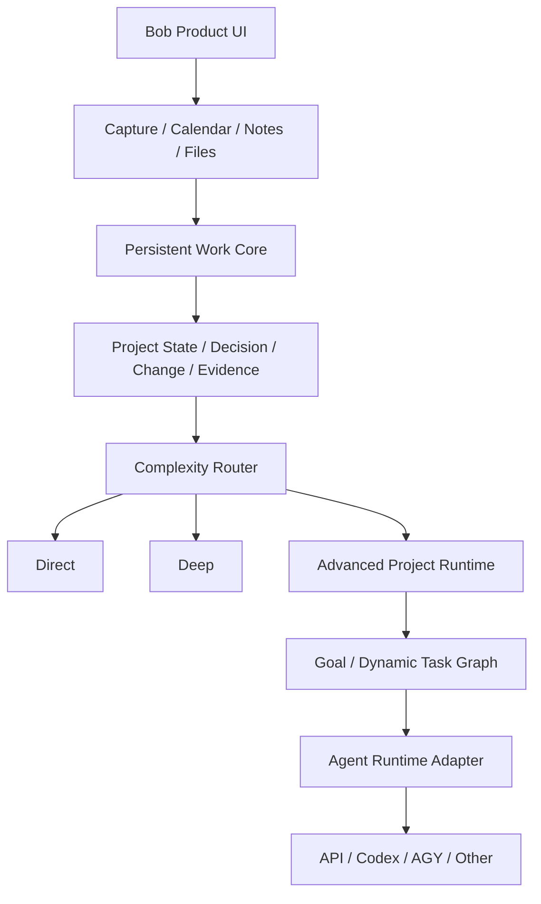

# bob-agent 技术架构

> **架构版本**: Tauri v2 (Rust) — 自 2026-05-10 完成从 Electron 的全面迁移
> **历史归档**: Electron 时代架构见 `docs/agents_electron.md`
> **Goal/Dream 目标架构**: 见 `docs/GOAL_RUNTIME.md`。本文件描述当前系统；目标文档中的未完成模块不得被当作现有能力。

## v0.8.1 演进边界（当前实现）

`v0.8.0` 已封存 Capture 与知识提交基线。`v0.8.1` 开发线已在现有 Rust 后端中建立隔离的 `work_core`，完成现有输入接入、完整 Decision 契约与 Change Review；没有重写 Tauri、Android、Sync、Relay 或 Tools，也没有增加客户端运行时依赖。



当前已实现 Work Object 契约、SQLite Repository、append-only Work Event、幂等与 revision、软删除、Project Aggregate、Markdown 快照、Tauri Commands、Bridge 和最小 `WorkView`。Capture Router 可以把明确项目任务、决策、承诺、会议派生项和文件成果写入 Work Core；Todo/Event、Note/Source 和文件继续保留各自真相源，`work_external_links` 只保存稳定引用。Decision 原生保存 reason、alternatives、rejected alternatives、participants、owner、evidence 与 revisit condition。新版文件创建不可变 Artifact revision 和 Change，并依据显式关系、Decision evidence 或经过同项目校验的影响提示生成 `work_change_reviews`。接受、拒绝、延后和重新打开都写入 Work Event；确认前不修改既有 Decision、Goal、Task、Artifact 或 Risk。Router、Advanced、Dynamic Graph 和 Runtime Adapter 仍是后续目标。

### 输入与 Project State 的当前边界

```text
Capture Journal (原始输入)
  ├─ 明确工作对象 ── project_links ── Work Object + Work Event
  ├─ Todo / Event ── Calendar 为状态真相源 ── stable external link
  ├─ Note / Source ── Markdown 为内容真相源 ── stable external link
  └─ File ── 原路径 + 流式 hash/size/mtime ── immutable Artifact revision + Change

歧义 / 缺字段 ── project_link_candidates ── WorkView 稍后归属或忽略
显式证据 / 关系 ── work_change_reviews ── 接受 / 拒绝 / 延后 ── Work Relation + Event
```

`project_link_candidates`、Work Object、Work Event、Capture refs 在同一个 SQLite transaction 中确认；文件修订的新版 Artifact、Change、外部路径指针和 Change Review 也原子提交。Markdown 先安全落盘再登记引用。外部对象的完成、取消、改期和删除只追加项目活动，不复制外部状态。快照在数据库提交并释放锁后 best-effort 刷新。

跨设备边界：`v0.8.1` 仍以 PC 端 Work Core 为项目状态权威源。移动端产生的 Capture 会通过现有同步链路回放并由 PC 落入 Work Core，但 `work_objects`、`work_relations` 与 `work_change_reviews` 尚不进行独立的双向表级合并。完整的跨设备 Work Core 合并需要后续协议版本、冲突规则与迁移测试；在此之前不得把 Phase 3 描述为多端状态双向同步完成。

## 总体架构

```
┌──────────────────────────────────────────────────────────┐
│                   Tauri v2 Shell (Rust)                   │
│                                                          │
│  ┌─────────── WebView (Vue 3 + Vite) ────────────────┐  │
│  │                                                    │  │
│  │  ChatView │ InboxView │ WorkView │ SettingsView     │  │
│  │  对话工具    日程待办    项目状态    配置与模型         │  │
│  │                                                    │  │
│  └───────────── tauri-bridge.js (适配层) ─────────────┘  │
│                         │ invoke() / listen()            │
│  ┌─────────── Rust Backend (src-tauri/src/) ─────────┐  │
│  │                                                    │  │
│  │  ┌──────────┐  ┌──────────┐  ┌──────────────────┐ │  │
│  │  │ llm.rs   │  │tools.rs  │  │ calendar.rs      │ │  │
│  │  │ LLM引擎  │  │工具引擎   │  │ 日程管理         │ │  │
│  │  │          │  │          │  │                  │ │  │
│  │  │ • Chat   │  │ • 12工具 │  │ • CRUD          │ │  │
│  │  │ • Vision │  │ • TC循环 │  │ • WeekTimeline  │ │  │
│  │  │ • SSE流  │  │ • 搜索   │  │ • 待办/日程     │ │  │
│  │  │ • ModelHub│  │ • 文件IO │  │ • SQLite        │ │  │
│  │  └──────────┘  └──────────┘  └──────────────────┘ │  │
│  │                                                    │  │
│  │  ┌──────────┐  ┌──────────┐  ┌──────────────────┐ │  │
│  │  │outbox.rs │  │ dream.rs │  │ filesystem.rs    │ │  │
│  │  │声明式配置 │  │ 做梦引擎 │  │ 文件操作         │ │  │
│  │  │          │  │          │  │                  │ │  │
│  │  │ • 写Outbox│ │ • Session│  │ • 读/扫描/跟踪  │ │  │
│  │  │ • 校验墙 │  │ • 晨报   │  │ • walkdir       │ │  │
│  │  │ • 调谐器 │  │ • 记忆   │  │ • 500KB 限制    │ │  │
│  │  └──────────┘  └──────────┘  └──────────────────┘ │  │
│  │                                                    │  │
│  │  ┌─────────────────────────────────────────────┐  │  │
│  │  │ lib.rs: Config │ DB │ Tray │ Mobile 适配   │  │  │
│  │  └─────────────────────────────────────────────┘  │  │
│  └────────────────────────────────────────────────────┘  │
└──────────────────────────────────────────────────────────┘

> **平台矩阵**: Windows / macOS (桌面主基地) + Android (移动前哨站/本地推理节点)
```

---

## 目录结构

```
bob-agent/
├── src-tauri/                       # Tauri 后端 (Rust) — 所有新代码写这里
│   ├── src/
│   │   ├── main.rs                  # Tauri 入口
│   │   ├── lib.rs                   # 🔑 Config + DB 初始化 + IPC 注册 + 系统托盘
│   │   ├── llm.rs                   # LLM 引擎 (SSE 流式 + Tool Calling 循环)
│   │   ├── tools.rs                 # 🔑 12 个原生工具 + 执行调度器
│   │   ├── capture.rs               # CaptureEnvelope + SQLite Journal + 幂等归并
│   │   ├── work_core/               # 持久项目状态、候选归属、外部引用、事件与 Markdown 快照
│   │   ├── calendar.rs              # 日程/待办管理 (SQLite)
│   │   ├── outbox.rs                # Outbox/Reconciler 声明式配置
│   │   ├── filesystem.rs            # 文件读取/扫描/跟踪
│   │   ├── web.rs                   # 网页抓取 (reqwest + scraper)
│   │   ├── plugins.rs               # 技能/插件扫描
│   │   ├── dream.rs                 # 做梦引擎 V1
│   │   ├── sidecar.rs               # Sidecar 子进程 (llama-server)
│   │   ├── kb_extractor.rs          # 知识库文件提取
│   │   └── kb_indexer.rs            # 知识库索引构建
│   ├── capabilities/
│   │   └── default.json             # 🔑 原生能力权限声明
│   ├── Cargo.toml                   # Rust 依赖管理
│   └── tauri.conf.json              # Tauri 应用配置
│
├── src/                             # Vue 3 前端 (Renderer) — 不直接改动 IPC 调用
│   ├── tauri-bridge.js              # 🔑 适配器：拦截 electronAPI → invoke()
│   ├── App.vue                      # 根组件 + 侧栏导航
│   ├── views/
│   │   ├── ChatView.vue             # 对话 + 视觉 + 工具调用展示
│   │   ├── InboxView.vue            # 日程面板（时间轴 + 待办）
│   │   ├── WorkView.vue             # 项目、目标、任务、决定与活动记录
│   │   └── SettingsView.vue         # 设置面板（含工作空间配置）
│   └── components/
│       ├── SetupWizard.vue          # 首次启动向导
│       ├── WeekTimeline.vue         # 周时间轴（可拖拽）
│       ├── SearchCard.vue           # 搜索结果卡片（与 FileCard 统一设计）
│       └── ...
│
├── skills/                          # 内置基础技能
├── data/                            # ⛔ .gitignore — 用户隐私数据
├── docs/                            # 架构、用户手册、历史归档
├── todo.md                          # 🔑 路线图（里程碑 1-10）
└── progress.yaml                    # 进度追踪
```

---

## Rust 后端模块详解 (`src-tauri/src/`)

### 1. LLM Engine (`llm.rs`)

**职责**：管理所有 LLM API 调用，支持多供应商 + Chat + Vision + SSE 流式 + Tool Calling。

```
核心函数:
  stream_internal()      — SSE 流式 + 按 IntentDecision 分配预算的 Tool Calling 循环 + Restatement
  get_model_pool()       — 返回 40+ 模型注册表 (含定价)
  get_active_models()    — 获取 Main/Clerk 角色绑定
  assign_model_role()    — 角色指派
  read_llm_config()      — 动态路由 Provider→API Key→Base URL
  build_memory_summary() — 三层记忆注入 (SOUL → Sessions → Wiki)

Restatement 机制 (防长线失焦):
  在 Tool Calling 循环的第 2 轮起，于 messages 数组尾部动态注入 system 消息，
  重申用户原始请求 + 人设约束。利用 LLM U 型注意力曲线 (首尾强，中间弱)，
  确保模型在消化大量工具结果后仍能准确归纳回答。

事件推送 (app.emit):
  "llm:chunk" → { type: "text"|"thinking"|"tool_start"|"tool_end"|"done"|"error", ... }
```

**供应商路由表**：

| Provider | Base URL | 模型示例 |
|----------|----------|----------|
| deepseek | api.deepseek.com | deepseek-chat, deepseek-reasoner |
| doubao | ark.cn-beijing.volces.com/api/v3 | doubao-1.5-pro-256k |
| qwen | dashscope.aliyuncs.com/compatible-mode/v1 | qwen3-235b-a22b |
| minimax | api.minimax.chat/v1 | MiniMax-M1 |
| glm | open.bigmodel.cn/api/paas/v4 | glm-4-plus |
| modelscope | api-inference.modelscope.cn/v1 | deepseek-v3-0324 (免费) |
| ollama | localhost:11434/v1 | 本地模型 |
| custom | 用户自定义 | 任意 OpenAI 兼容端点 |

### 2. Tool Calling Engine (`tools.rs`)

**职责**：Agent 的"手" — 12 个 Rust 原生工具 + 执行调度器。

```rust
// 工具注册表
pub fn get_tool_schemas() -> Vec<Value>    // OpenAI Function Calling 格式
pub async fn execute_tool(app, name, args, from_user) -> Value  // 异步执行调度 + 审计日志 + 微信上下文感知

// 安全层
fn resolve_write_path(path, global_file_access) -> Result<PathBuf, String>  // 路径白名单引擎
fn audit_tool_call(name, args, result_summary)  // 写入 logs/tools.log
```

> **from_user 上下文感知**：当工具调用源自微信会话时，`from_user` 携带消息发送者的加密 wxid。
> `send_wechat_file` 会用它覆盖 LLM 传入的非加密 wxid，确保 ilink CDN API 收到正确的目标 ID。

| 工具 | 来源 | 描述 |
|------|------|------|
| `read_file` | filesystem.rs 复用 | 读取文本文件 (≤500KB) |
| `list_dir` | tools.rs 原生 | 浏览目录 |
| `write_file` | tools.rs 原生 | 安全写入 (resolve_write_path 白名单: wiki/workspaceDir/tracked_folders) |
| `append_file` | tools.rs 原生 | 追加内容 |
| `fetch_url` | web.rs 复用 | 网页抓取 (≤2MB, 10s 超时) |
| `web_search` | tools.rs 原生 | Tavily (主) + TinyFish (降级) |
| `list_skills` | tools.rs 原生 | 列出 49 个可用技能 |
| `read_skill` | tools.rs 原生 | 读取 SKILL.md 全文 |
| `system_time` | tools.rs 原生 | 当前时间+时区+星期 |
| `get_weather` | tools.rs 原生 | wttr.in 天气查询 |
| `brain_search` | tools.rs 原生 | 知识库全文检索 (wiki/) |
| `add_calendar_event` | tools.rs + calendar.rs | 写入 SQLite events 表 |
| `send_wechat_file` | tools.rs + wechat/ | 发送图片/文件给微信用户 (CDN 上传 + 加密) |

### 3. Calendar Engine (`calendar.rs`)

**职责**：日程/待办管理，SQLite 持久化。

```
Tauri Commands:
  system_list_events()        — 列出所有事件
  system_parse_event(text)    — 自然语言→结构化事件 (V1 关键词匹配)
  system_confirm_event(event) — 保存到数据库
  system_delete_event(id)     — 删除
  system_update_event_status(id, status) — 状态变更 (pending/done/cancelled)
  system_update_event_time(id, start, end) — 拖拽调整时间
```

### 4. Outbox/Reconciler (`outbox.rs`)

**职责**：AI 声明式配置引擎。AI 只写 Outbox 文件，Rust 守护者单向校验后生效。

```
数据流: AI 输出 bob-config 代码块 → writeOutbox() → bob_outbox.json
       → Reconciler (2s 轮询) → validate_operation() → config.json 生效
       → app.emit("config:reconciled") → 前端自动刷新

安全防线: 6 层校验 (op 白名单 + provider 合法性 + key 长度 + config key 白名单 + 备份 + 审计日志)
```

### 5. 其他模块

| 模块 | 职责 |
|------|------|
| `lib.rs` | 入口 + config CRUD + DB 初始化 + 所有 Tauri Command 注册 + 系统托盘 + 全局快捷键 (Ctrl+Shift+B) + 单实例锁 |
| `filesystem.rs` | 文件读取/扫描/文件夹跟踪 |
| `web.rs` | reqwest + scraper 网页抓取 |
| `plugins.rs` | 技能/插件扫描 (SKILL.md YAML frontmatter) |
| `dream.rs` | 做梦引擎 V2 (Clerk 异步压缩 + 7天冷热迁移 + 晨间简报) |
| `evolution.rs` | 运行遥测、事实/纠错提取、每日记忆整理、SOUL 精炼与失败模式分析 |
| `goal.rs` | 当前 Maker–Checker Goal Loop 原型：断言、Clerk 验收与三轮外层重试 |
| `capture.rs` | 统一接收快捷笔记、聊天 memo、Android 分享和知识收藏；记录状态、幂等键与派生对象引用 |
| `sidecar.rs` | Sidecar 子进程管理 (llama-server 离线推理) |
| `kb_extractor.rs` | 知识库文件提取 (PDF/DOCX/XLSX → 纯文本) |
| `kb_indexer.rs` | 知识库索引构建 |

---

## IPC 通信模型

Tauri v2 采用 `invoke()` (前端→Rust) + `app.emit()` (Rust→前端) 双通道：

```javascript
// src/tauri-bridge.js — 适配器层
window.electronAPI = {
  // 同步调用 Rust Command
  getConversations: () => invoke('db_conversations'),
  listEvents:      () => invoke('system_list_events'),
  
  // 监听 Rust 推送事件
  onStreamChunk: (cb) => listen('llm:chunk', (e) => cb(e.payload)),
  onConfigReconciled: (cb) => listen('config:reconciled', (e) => cb(e.payload)),
};
```

> **铁律**: Vue 组件统一调用 `window.electronAPI.xxx()`，不直接 import `@tauri-apps/api`。
> 所有 Tauri 特有 API 仅在 `tauri-bridge.js` 中使用。

---

## IPC 实现状态速查表

### 🟢 已用 Rust 实现（真实调用）

Capture 主命令：`capture_ingest`、`capture_quick_note`、`capture_mobile_image`、`capture_list`、`capture_retry`、`capture_diagnostics`、`capture_activity_list`。前端必须经 `tauri-bridge.js` 调用，不应直接写笔记后再假设捕获成功。

| 分类 | 前端调用 | Rust Command | 说明 |
|:---|:---|:---|:---|
| 配置 | `isSetupComplete()` | `system_is_setup_complete` | config.json 判断 |
| 配置 | `getConfig/setConfig/getAllConfig` | `config_get/set/get_all` | 键值 CRUD |
| 对话 | `getConversations/create/delete/rename` | `db_conversation_*` | rusqlite CRUD |
| 消息 | `getMessages/addMessage` | `db_messages/db_message_add` | rusqlite |
| LLM | `sendChat/sendVision` | `llm_chat/llm_vision` | reqwest SSE + Tool Calling |
| LLM | `getModelPool/getActiveModels/assignModelRole` | `llm_get_*` | ModelHub |
| 凭证 | `getApiKeys/setApiKey` | `system_get/set_api_key` | config.json 存储 |
| 日程 | `listEvents/confirmEvent/deleteEvent/...` | `system_list/confirm/delete_event` | calendar.rs SQLite |
| 文件 | `readFile/scanFolder/getFileMeta` | `filesystem::system_*` | walkdir + fs |
| 文件夹 | `getTrackedFolders/add/remove` | `filesystem::system_*_tracked_*` | config 持久化 |
| 网页 | `fetchUrl` | `web::system_fetch_url` | reqwest + scraper |
| 知识库 | `estimateKB/buildKB` | `kb_extractor/kb_indexer` | PDF/DOCX/XLSX 提取 |
| 插件 | `getPlugins` | `plugins::system_get_plugins` | 技能扫描 |
| 做梦 | `summarizeSession/getDreamReport/dismissDream` | `dream::system_*` | 记忆引擎 |
| Outbox | `writeOutbox` | `system_write_outbox` | 声明式配置 |
| 系统 | `openFile/showInFolder/getVersion/factoryReset/...` | `system_*` | Rust 原生 |

### 🔴 仍为 Mock（Bridge 中硬编码）

| 接口 | 说明 |
|:---|:---|
| `updateTheme` | 主题热切换（目前 console.log） |
| `getClipboardImage` | 剪贴板图片读取（返回 null） |
| `showNotification` | 桌面通知（console.log） |
| `getMcpConfig/setMcpConfig` | MCP 服务器配置 |
| `installPlugin` | 插件安装逻辑 |

---

## 数据库 Schema (SQLite / rusqlite)

数据库位于 `%LOCALAPPDATA%/bob-agent/bob.db`：

`capture_journal` 是所有轻量输入的接收账本。它保存版本化 Envelope、规范化内容哈希、唯一幂等键、状态与错误阶段、重试次数/下次重试时间、来源/同步范围及派生对象引用。跨端同步包含 `captures` 集合，并通过幂等键归并；状态只能单调推进，较新的失败不能覆盖本地 committed/synced 终态。

当调用方未显式提供 `source_url` 时，Capture 会从原始文本或 Markdown 链接中提取首个 HTTP(S) URL。聊天文章保存、快捷笔记和 Android 文本分享因此使用同一来源识别规则；入口与显式意图仍被保留，避免把“收藏知识”和“记下灵感”混为一类。

`capture_events` 是用户活动记录，不是另一套状态机。它只保存语义事件代码和参数，每个来源设备保留最近 50 条；前端按当前 locale 翻译。同步 trace、Relay 心跳和协议诊断继续使用 `sync_history`，不污染普通 Capture 活动。

PC 文件默认原位引用。Android 图片因系统 URI 权限短暂，归档到 `notes/assets/captures/images/YYYY/MM/<capture_id>--<hash8>--<original>`；原子复制成功后才清理缓存。图片当前为 `local_only`，SQLite 同步导出会排除它，直到阶段 3 提供真实资产传输。

### 可迁移知识对象（实施中）

长期认知资产以 Markdown 为真相源，SQLite 只保存 Capture 运行状态和可重建的搜索、关系与图谱索引。`knowledge_schema.rs` 定义稳定 ID、对象类型、关系词表、兼容解析、严格新对象校验和安全文件提交；`knowledge_audit.rs` 只读扫描 `notes/` 与 `wiki/`，识别重复、旧类型和失效引用。正式契约见 `docs/KNOWLEDGE_SCHEMA.md`，完整演进设计见 `docs/superpowers/specs/2026-08-10-unified-knowledge-lifecycle-design.md`。

当前阶段只增加契约和审计能力，不移动 AppData 真实文件，也不切换 Notebook、Dream 或 Graph 的现有读取路径。

应用启动时调用 `recover_incomplete_captures()`。只有 `quick_note`、`chat_memo`、`mobile_share` 文本入口会被自动重放；笔记条目使用隐藏 `capture_id` 标识实现文件层幂等。未知入口保持 pending，等待后续分类器或用户操作，避免错误归档。

统一分流的目标契约是“离线捕获、延迟理解、确定性提交”。Capture 先在本地落账；明确日期和显式意图由轻量规则直接处理，复杂口语由 Clerk 转换为结构化候选。Clerk 不直接调用日历或写入长期知识文件，候选必须经过本地 schema、日期、时区、冲突和幂等校验，再由工具层提交。断网或模型不可用时保留 `pending_enrichment`，恢复后从失败阶段续跑；只有真实工具回执才能把活动标记为成功。

`knowledge_committer.rs` 是 QuickNote、Note 与 Source 的唯一 Capture 提交边界。Note 使用内容身份，Source 使用规范化 URL 或原文件身份；重复捕获复用同一稳定对象。项目归属只存在于 Note：显式稳定 ID 可直接使用，项目名称必须在本地 Project Markdown 中唯一匹配，否则进入澄清状态。仅有 URL 的 Source 先保存为 `pending_extraction`，后续提取与蒸馏不得覆盖原始来源。

```sql
-- 对话历史
CREATE TABLE conversations (
  id TEXT PRIMARY KEY,
  title TEXT NOT NULL DEFAULT '新对话',
  model TEXT DEFAULT '',
  cost REAL DEFAULT 0.0,
  last_message TEXT,
  last_role TEXT,
  created_at INTEGER NOT NULL,
  updated_at INTEGER NOT NULL
);

CREATE TABLE messages (
  id INTEGER PRIMARY KEY AUTOINCREMENT,
  conversation_id TEXT NOT NULL REFERENCES conversations(id) ON DELETE CASCADE,
  role TEXT NOT NULL,
  content TEXT NOT NULL DEFAULT '',
  image_base64 TEXT,
  created_at INTEGER NOT NULL
);

-- 日程事件
CREATE TABLE events (
  id TEXT PRIMARY KEY,
  title TEXT NOT NULL DEFAULT '',
  type TEXT NOT NULL DEFAULT 'event',    -- event | todo
  status TEXT NOT NULL DEFAULT 'pending', -- pending | done | cancelled
  date TEXT,
  start_time TEXT,                        -- YYYY-MM-DD HH:MM:SS 格式
  end_time TEXT,
  description TEXT DEFAULT '',
  created_at INTEGER NOT NULL
);

-- 配置键值
CREATE TABLE config (
  key TEXT PRIMARY KEY,
  value TEXT
);

-- 关注的文件夹
CREATE TABLE tracked_folders (
  id TEXT PRIMARY KEY,
  folder_path TEXT NOT NULL UNIQUE,
  created_at INTEGER NOT NULL
);
```

---

## 配置管理

用户配置存储在 `%LOCALAPPDATA%/bob-agent/config.json`：

```json
{
  "setupComplete": true,
  "language": "zh-CN",
  "theme": "dark",
  "accentColor": "blue",
  "wikiDir": "D:\\path\\to\\wiki",
  "externalSkillsDir": "D:\\path\\to\\skills",
  "apiKeys": {
    "deepseek": "sk-...",
    "doubao": "...",
    "tavily": "tvly-..."
  },
  "mainModel": "deepseek-chat",
  "clerkModel": "deepseek-v3-0324"
}
```

> ⚠️ API Key 目前明文存储。T-303 计划迁移至 `tauri-plugin-stronghold` 加密存储。

---

## 构建与打包

```bash
# 开发 (Vite 热更新 + Rust 编译)
npm run dev:tauri

# 生产打包 (~15MB 安装包)
npm run build:tauri

# 仅检查 Rust 编译
cd src-tauri && cargo check

# 前端测试
npm test
```

---

## 模型生态扩展指南 (LLM Provider Extension)

未来当需要在 `bob-agent` 中新增模型或全新大模型供应商时，必须遵循以下 Tauri 后端扩展规范：

### 1. 新增现有厂商的模型
若仅新增（如 `deepseek-v5` 或 `qwen-4`），只需修改 `src-tauri/src/llm.rs` 中的 `get_model_pool()`：
- 在 JSON 数组中添加模型条目。
- 必须包含 `provider`（如 `"deepseek"`）和 `pricing` 字段（如 `{"input": 1.0, "output": 2.0}`）。
- 后端会自动依据 `provider` 将请求路由至官方 `baseURL`。

### 2. 接入全新的大模型厂商 (Provider)
若要接入如 `anthropic` 等全新厂商，需要修改 `src-tauri/src/llm.rs` 的 3 个位置：
1. **模型池注册**：在 `get_model_pool()` 中添加模型，声明新的 `provider`（如 `"anthropic"`）。
2. **防误判路由注册**：在 `read_llm_config_for_model` 方法的 `is_custom_proxy` 白名单中，将该厂商的官方域名（如 `!base_url.contains("anthropic.com")`）加入排除名单，以防止智能路由将其误判为用户的自定义反向代理。
3. **官方 Base URL 映射**：在 `read_llm_config_for_model` 的 `match provider.as_str()` 块中，添加 `"anthropic" => "https://api.anthropic.com/v1"` 的映射分支。
*(注意：如遇特殊厂商不支持标准参数，需在 `stream_internal` 构建请求体时添加特定的分支逻辑。)*

---

## 核心技术决策记录

### D-001: 从 Electron 迁移至 Tauri（决策变更）

**原决策**：使用 Electron（因为开发者不会 Rust）
**新决策**：迁移至 Tauri v2 (Rust)

**变更理由**：
- 代码完全由 AI Agent 编写，Rust 不再是门槛
- Rust 编译器的极致类型检查 = AI 最完美的反馈循环（编译通过 ≈ 无 Bug）
- 打包体积从 ~120MB 骤降至 ~15MB
- 内存占用从 ~300MB 降至 ~30MB
- 彻底告别 `node_modules` 黑洞和 `better-sqlite3` 的 C++ 编译地狱

**迁移策略**：Adapter 隔离法（`tauri-bridge.js`），前端零感知，后端逐模块替换。

### D-002: 为什么不做 Web App？

（不变）桌面原生应用。需要本地文件读取、系统托盘、全局快捷键、桌面通知。

### D-003: 双目录技能系统

（不变）内置 `skills/` + 用户可配置外部技能目录。SKILL.md 规范复用。

### D-004: LLM 多模型支持

**供应商优先级**：
1. DeepSeek (deepseek-v4-pro / deepseek-v4-flash) — 默认
2. ModelScope 免费层 (DeepSeek-V4-Flash / GLM-5.1) — Clerk 任务
3. Qwen (qwen3.5-flash / qwen3.5) — 备选
4. Ollama (本地模型) — 离线场景
5. 自定义 (OpenAI 兼容端点) — 高级用户

### D-005: 三层记忆引擎

当前基线为 Tier 1 灵魂 (SOUL.md) → Tier 2 短期记忆 (sessions/) → Tier 3 长期记忆 (wiki/)，并以 `memory_entries` 保存 scope/source/confidence/evidence/version。下一阶段不再把所有内容压入 SOUL，而是按 identity/preference/episodic/procedural/project/correction 分层，详见 `docs/GOAL_RUNTIME.md`。

### D-006: Goal Runtime 与执行图分离

**决策**：Goal 是终态、验证、预算和恢复的持久控制闭环；执行 DAG 只描述子任务依赖；Knowledge Graph 只描述语义关系，三者使用不同的数据契约。

**理由**：
- 避免把对话计划误当成可恢复状态；
- 允许独立节点使用干净上下文，依赖节点只传递结构化 artifact；
- 允许失败节点局部重跑并使下游失效；
- Done 必须绑定外部证据，而不是依赖执行模型自述；
- Dream 可以从完整 Goal 轨迹学习，而不是只从最终文本猜测。

**约束**：Goal/DAG 运行时使用 Rust + SQLite 原生实现，不增加 PC/Android 用户侧 Python 或 Node 运行时。完整设计与完成门槛见 `docs/GOAL_RUNTIME.md`，开发任务见 `todo.md` 目标 31。

---

## 依赖清单

### Rust 后端 (`src-tauri/Cargo.toml`)

| Crate | 用途 | 状态 |
|:---|:---|:---|
| `tauri` v2.0.0-rc | 桌面应用框架 | ✅ |
| `serde` + `serde_json` | JSON 序列化 | ✅ |
| `dirs` | 跨平台用户数据目录 | ✅ |
| `rusqlite` (bundled) | SQLite 数据库 | ✅ |
| `reqwest` (stream + json) | HTTP 客户端 (LLM/搜索/天气) | ✅ |
| `tokio` (full) | 异步运行时 | ✅ |
| `walkdir` | 文件夹递归扫描 | ✅ |
| `scraper` | HTML DOM 解析 | ✅ |
| `pdf-extract` + `calamine` + `quick-xml` + `zip` | 知识库文件解析 | ✅ |
| `chrono` | 时间处理 | ✅ |
| `tauri-plugin-dialog` | 原生文件对话框 | ✅ |
| `tauri-plugin-log` | 日志 | ✅ |
| `tauri-plugin-shell` | 打开外部文件/链接 | ✅ |
| `tauri-plugin-single-instance` | 防双开 | ✅ |
| `tauri-plugin-stronghold` | 加密凭据存储 | 🔜 计划中 |

### 前端 (`package.json`)

| 包 | 用途 |
|:---|:---|
| `vue` 3.x | 前端框架 |
| `vite` 6.x | 构建工具 |
| `@tauri-apps/api` | Tauri 前端 IPC SDK |
| `@tauri-apps/plugin-dialog` | 对话框前端绑定 |
| `marked` + `highlight.js` | Markdown 渲染 |
| `lucide-vue-next` | 图标库 |
| `vue-i18n` | 国际化 |

### 待清理的 Electron 遗留依赖

以下 `package.json` 中的依赖是 Electron 时代遗留，Tauri 不使用但尚未清理：
`electron`, `electron-builder`, `electron-log`, `better-sqlite3`, `openai`, `mammoth`, `xlsx`, `pdf-parse`, `cheerio`, `concurrently`, `dotenv`, `ws`, `officeparser`

> 在 M7 (T-703 打包发布) 时应彻底清理。
