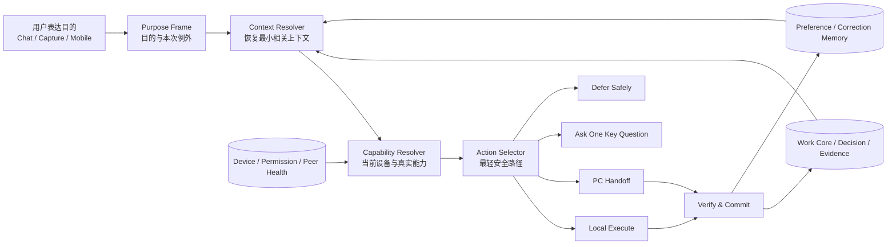

# Bob Architecture V3：从大语言模型产品到个人长期助手

> 文档状态：已确认方向的目标设计，尚不代表全部实现现状
>
> 基线版本：Bob v0.9.2，commit `be7f617`
>
> 更新日期：2026-08-14
>
> 愿景权威：[PRODUCT_VISION.md](PRODUCT_VISION.md)，本文不修改产品愿景
>
> 路线关系：在现有 Phase 5 与 Phase 6 之间增加 **Phase 5.5 Personal Assistant Intelligence**

## 0. 最终裁决

Bob 不是一个装在桌面里的大语言模型，也不是九个 Agent 框架的功能合集。Bob 是一个借助模型和工具工作的个人长期助手：

> **用户负责表达目的，Bob 负责恢复上下文；用户只补充本次例外和不可推断的关键选择。**

模型、PowerShell、浏览器、MCP、手机沙盒和远端执行器都是可替换资源。Bob 自己必须长期持有的是：这个人的工作模型、项目状态、决定、承诺、偏好、设备能力和经过验证的结果。

因此 V3 的近期目标不是增加更多器官，而是让 Bob 在日常使用中表现出五种成熟：

1. 用户不需要反复解释背景；
2. Bob 知道自己当前处于什么设备和权限环境；
3. Bob 选择最轻、最稳、真实可用的工具；
4. 临时错误尽量安静恢复，重大分歧才打扰用户；
5. 任务完成后更新真实状态，并记住明确纠正。

## 1. 不可偏离的设计原则

### 1.1 Purpose first

用户的自然输入应主要是“目的 + 本次例外”，例如：

> 把这个项目推进到可评审状态，周五前，别动正式数据。

- “推进到可评审状态”是目的；
- “周五前”是期限；
- “别动正式数据”是本次例外；
- 当前项目、历史决定、相关文件、阻塞和下一步由 Bob 恢复。

### 1.2 Context is Bob's responsibility

Bob 优先从 Persistent Work Core、Decision、Change、Evidence、Today、Session 与结构化记忆中恢复上下文。聊天记录只能补充临时语义，不能成为长期工作状态的唯一来源。

### 1.3 Environment aware, capability bounded

Bob 只能使用当前设备真实存在、健康且已授权的能力。不存在的 PowerShell、浏览器、Office、Shell、登录态或手机执行环境绝不能因为模型“知道这种工具”而被假定可用。

### 1.4 Simplest viable path

同一个目的存在多种路径时，优先级固定为：

```text
确定性本地操作
→ 已有 Rust 原生工具
→ 已配对设备转交
→ 用户明确配置的外部能力
→ 询问或延后
```

简单任务不进入 Goal Runtime、DAG、多 Agent 或模型修复循环。

### 1.5 Continuity over cleverness

重启不丢任务、不会重复产生副作用、能说明真实进度，比单次回答显得聪明更重要。

### 1.6 Evolve without burden

- PC 安装版和绿色版不增加用户侧必装运行时；
- Android 不引入通用 Shell、容器或沉重执行环境；
- 不增加必须长期驻留的第二后台服务；
- 新能力关闭或退化时，Capture、Work、记忆与本地查看仍可用；
- 工程概念不暴露给普通用户。

## 2. 当前基础与真实缺口

### 2.1 已有基础

Bob 已经具备可复用的正确骨架：

- Tauri/Rust + SQLite 桌面与 Android 客户端；
- Persistent Work Core、Decision/Change Review 与 append-only Work Event；
- Direct / Deep / Advanced Complexity Router；
- 单 Agent Goal Runtime、Evidence gate、审批和安全恢复；
- Conversation-first Today Layer；
- `std::env::consts::OS` 粗粒度平台识别；
- 手机端过滤部分 PC 专属工具，并可通过 `send_to_pc_agent` 转交；
- Doctor 对配置、数据库、API Key、模型和数据目录做基础检查；
- R0–R3 Policy Engine 约束高风险工具。

### 2.2 当前缺口

Bob 还没有形成“个人助手的环境与上下文判断闭环”：

- 不能稳定识别用户一句“这个项目”具体指向哪个 Work Object；
- 上下文主要仍在系统 Prompt 中长文本拼接，来源、时效和置信度不够明确；
- 没有统一的环境能力卡，无法确认 PowerShell、Git、浏览器等是否真实可用；
- 手机沙盒是应用文件与权限沙盒，不是通用命令执行环境；
- 手机与 PC 的选择主要依靠固定提示词和工具过滤，不是实时能力决策；
- `run_command` 出现在验证预期中，但当前核心工具表没有对应的通用命令执行实现；
- 用户纠正、单次例外和长期偏好仍需要更严格地区分。

V3 首先补齐这些缺口，不重写已经验证的 Work Core。

## 3. Phase 5.5 目标架构



这不是第二套 Runtime。它是现有 `llm.rs`、`tools.rs`、Work Core、Goal Runtime、Doctor 与 Sync Engine 之间的一层薄契约。

### 3.1 四条通道

1. **理解通道**：从用户表达中提取目的、期限和例外；
2. **事实通道**：从现有 SQLite/Markdown 权威源恢复上下文；
3. **能力通道**：确认当前设备真正能做什么；
4. **行动通道**：选择本地、转交、询问或延后，并验证结果。

模型只参与需要语义判断的部分。事实读取、能力探测、风险判断和结果提交优先使用 Rust 确定性逻辑。

## 4. 最小数据契约

这些契约可先作为 Rust struct 和内存值存在。除缓存和纠正记录外，不为它们新建复杂数据库子系统。

### 4.1 PurposeFrame

```text
raw_intent          用户原话
desired_outcome     期望结果
deadline            明确或推断的期限
explicit_constraints 本次显式约束
candidate_refs      可能关联的 Project/Goal/Task/Artifact
confidence          对目的理解的置信度
```

PurposeFrame 不要求用户填写表单；它由 Bob 从自然语言编译，并在重大歧义时用一句话确认。

### 4.2 AssistantContext

```text
active_object       本次最可能的工作对象
relevant_facts      带 source、freshness 的必要事实
decisions           仍有效的相关决定
open_commitments    未完成承诺与下一步
preferences         与当前任务有关的稳定偏好
explicit_constraints 本次例外
conflicts           冲突或过期信息
confidence          上下文匹配置信度
```

AssistantContext 只包含完成当前目的所需的最小事实，不复制完整项目、知识图谱或历史聊天。

### 4.3 CapabilitySnapshot

```text
device_id / device_role
os / architecture
sandbox_scope
granted_paths
local_capabilities[]
connected_peers[]
captured_at / expires_at
```

每个 capability 至少包含：

```text
id
state: available | degraded | unavailable
version（可选）
permission_scope
risk_class
reason_code
```

### 4.4 ActionDecision

```text
route: local_execute | pc_handoff | ask | defer
capability_id
risk_class
approval_required
reason_code
fallback
```

### 4.5 ResultReceipt

```text
decision_id
status
verified_evidence
state_changes
side_effect_state
correction_refs
completed_at
```

Receipt 的目的只是验证、恢复和去重，不建设全量事件平台。

## 5. Context Resolver：让用户只说目的

### 5.1 恢复顺序

1. 读取用户显式提到的项目、人、文件或期限；
2. 结合 Today 当前焦点、最近活动和未完成承诺生成候选对象；
3. 从 Work Core 读取候选对象的 Goal、Task、Decision、Change 与 Evidence；
4. 加入与本次任务直接相关的稳定偏好；
5. 检查事实来源、时效、冲突与权限；
6. 生成有界 AssistantContext。

不新增向量数据库。首版复用现有 ID、关系、SQLite 查询、FTS 和确定性排序；只有对象匹配确实模糊时才使用一次短模型判断。

### 5.2 置信度门

| 状态 | Bob 行为 |
|---|---|
| 高置信度、低风险 | 直接选择最轻路径推进 |
| 中置信度或可逆分歧 | 用一句话确认自己的理解 |
| 低置信度、对象冲突 | 只问一个能消除分歧的问题 |
| 不可逆或高风险 | 展示关键影响并等待批准 |

Bob 不为礼貌重复询问已经知道的事实，也不以“成熟助手”为借口隐藏重大假设。

### 5.3 上下文预算

- Direct：当前意图 + 最少事实，不注入完整项目摘要；
- Deep：加入相关 Decision、Change、Artifact 与来源；
- Advanced：加入 Goal Contract、当前阶段、上游结果和未解决阻塞；
- 单项长内容只提供摘要、差异或按需读取入口；
- 聊天噪音、无关项目和过期偏好默认排除。

## 6. Capability Resolver：感知环境而不增加负担

### 6.1 探测策略

能力探测分为两层：

- **启动时粗探测**：设备角色、OS、架构、应用沙盒、授权目录、已配对设备和基础健康；
- **任务触发细探测**：只有当目的需要某个能力时，才检查命令、版本、权限和健康状态。

结果带 TTL 并短期缓存。失败时返回 `degraded/unavailable + reason_code`，不悄悄安装软件。

### 6.2 Windows

当任务需要 Shell 时才探测：

1. `pwsh.exe` 是否存在且可启动；
2. 否则探测系统 `powershell.exe`；
3. 两者均不可用时，不向模型暴露 PowerShell 能力；
4. 只执行已授权、风险分类明确的动作；
5. 不读取全部环境变量值，不采集密钥和无关目录。

Git、浏览器、Office 等同样按需检查。路径与版本探测优先复用 Rust 标准库和现有依赖，不新增 Python/Node Runtime。

### 6.3 Android

Android 本地能力由应用实际拥有的 Tauri/Rust 接口和系统权限构成，例如：

- 日程、待办、笔记、知识查询和 Capture；
- 应用沙盒中的受控文件；
- 网页搜索、相机/扫码和同步；
- 与已配对 PC 的安全转交。

Android 的应用沙盒不等同于通用 Shell。首版不集成 Termux、容器、Python 或 Node。需要桌面文件、桌面命令、复杂文档或 PC 登录态时，Bob 选择 `pc_handoff`；PC 不在线则保存任务并说明等待条件。

### 6.4 能力选择纪律

- 能本地可靠完成，不转交；
- 能用确定性工具完成，不调用模型生成脚本；
- 能用已有 Rust 能力完成，不要求安装外部工具；
- 外部能力只有用户已经配置且当前健康时才参与；
- 高风险能力存在也不等于已经授权；
- 能力不可用时降级、延后或询问，绝不伪造成功。

## 7. Action Selector：四种结果足够

### 7.1 local_execute

当前设备存在合适能力、权限满足且风险允许。简单动作直接执行；Advanced 才交给 Goal Runtime。

### 7.2 pc_handoff

手机无法本地完成、PC 在线且任务适合转交。Handoff 只传递目的、必要上下文、权限请求和期望回执；它本身不等于高风险批准。

### 7.3 ask

只用于无法推断的关键选择：对象冲突、不可逆方案、高风险授权或结果标准不明确。一次只问一个能改变行动路径的问题。

### 7.4 defer

能力暂不可用、设备离线、预算不足或等待外部条件时，将请求保存为可恢复状态，并说明恢复条件。不能把“已经排队”说成“已经完成”。

## 8. 有界自愈与真实完成

### 8.1 失败处理

| 失败类型 | 默认行为 |
|---|---|
| 网络抖动、短超时、SQLite busy | Rust 确定性退避重试一次 |
| 明确格式或参数错误 | 使用确定性修正规则重试一次 |
| Advanced 验证失败且无未知副作用 | 允许一次模型诊断并改变策略 |
| 权限拒绝、能力不存在 | 降级、转交或说明限制 |
| 未知副作用、不可逆风险 | 立即停止并请求用户决定 |

不允许用同一策略盲目重复三次。简单任务不启动模型反思循环。

### 8.2 完成定义

模型输出、文件生成或转交 ACK 都不是完成。完成必须满足：

- 目标结果已经存在；
- 必需 Evidence 已验证；
- Work Core 的真实状态已更新；
- 副作用状态已知；
- 需要后续跟进时已形成 Commitment/Task。

## 9. 纠正与成长

近期成长优先级是“记住用户纠正”，不是自动生成 Skill。

### 9.1 三类输入

| 用户表达 | 处理方式 |
|---|---|
| “这次不要发出去” | 本次例外，不升级为长期偏好 |
| “以后报告都先给结论” | 显式长期偏好，可直接记录 |
| 多次重复同一纠正 | 生成偏好候选，询问是否长期记住 |

所有长期记忆带 scope、source、confidence、created_at 和可撤销入口。

### 9.2 暂不实施

- 不自动写入或激活 `SKILL.md`；
- 不让 Dream 修改 SOUL、Policy 或执行权限；
- 不内置 Python/Lua 解释器；
- 不根据一次成功就形成长期程序性规则。

复杂成功经验可以先保存为可审阅的经验卡片。只有重复证明节省时间后，才评估 Skill 候选机制。

## 10. 状态与检查点策略

V3 不全面迁移到新的 Event Sourcing 底座：

- Project/Goal/Task/Decision 等继续以现有 Work Core SQLite 为运行事实源；
- Source/Note/Knowledge/长期内容继续遵守现有 Markdown 权威边界；
- Goal Runtime 继续保存 Run、Attempt、Evidence、Checkpoint、Approval 与 Event；
- Phase 5.5 只补充理解、能力选择、转交和结果所需的少量检查点；
- 外部副作用依赖幂等键和 ResultReceipt 去重，不在恢复时盲目重放；
- 不建立 projection、snapshot、通用 event reducer 等第二套基础设施。

如果未来真实故障数据证明现有恢复边界不足，再针对具体域扩展，而不是先建设通用事件平台。

## 11. Phase 5.5 实施顺序

### 5.5-A：文档与性能基线

- 修订 V3 蓝图并冻结非目标；
- 记录 PC 安装版、绿色版和 Android APK 体积；
- 记录冷启动、空闲内存/CPU 与数据库增长基线；
- 建立五个日常场景的当前结果快照。

### 5.5-B：Context Resolver v1

- 定义 PurposeFrame 与 AssistantContext；
- 复用 Today/Work Core/Decision/Change/Evidence 做候选对象解析；
- 引入来源、freshness、conflict 与置信度门；
- 将 `llm.rs` 的全量长文本注入逐步改成有界上下文包；
- 建立中英文对象歧义与恢复测试。

### 5.5-C：Capability Snapshot v1

- 定义设备、沙盒、权限、本地能力和已连接 Peer 契约；
- Windows 按需探测 PowerShell、Git 与浏览器等首批能力；
- Android 明确本地能力白名单与 PC handoff 边界；
- Doctor 提供健康 reason code；
- 不可用能力不进入模型工具列表。

### 5.5-D：Action Selector 与跨端闭环

- 实现 `local_execute | pc_handoff | ask | defer`；
- 确定性能力和风险规则优先；
- 收紧 `send_to_pc_agent` 的上下文、审批和回执；
- 对离线、超时、重复投递和未知副作用做故障注入。

### 5.5-E：Result Commit 与纠正记忆

- 统一最小 ResultReceipt；
- 只有验证后才能提交 Work 状态；
- 区分本次例外、显式偏好和重复纠正候选；
- 提供查看、撤销和作用域限制；
- 完成五个日常场景验收。

## 12. 五个日常验收场景

### S1：PC 目的驱动

用户说：“把这个项目推进到可评审状态。”

验收：Bob 正确找到当前项目、相关决定、未完成任务和下一步；高置信度时不要求用户重述背景。

### S2：手机本地处理

用户说：“明天提醒我跟王总确认方案。”

验收：Android 直接写入日程/待办，验证后回复，不唤醒 PC。

### S3：手机转交电脑

用户说：“把桌面那份周报整理成正式版本。”

验收：Bob 知道手机不能直接访问桌面文件；目标文件唯一时申请必要转交，存在多个候选时只问一个问题。

### S4：对象歧义

用户说：“把招商项目继续推进。”，当前有两个活跃招商项目。

验收：Bob 展示最小差异并只询问一次，不猜测执行。

### S5：能力缺失

用户请求需要 PowerShell 或浏览器的工作，但能力不存在或未授权。

验收：相关工具不暴露给模型；Bob 选择已有替代路径、转交或说明限制，绝不伪造结果。

## 13. 质量门

### 13.1 交付边界

- 不增加用户侧 Python、Lua、Node、Playwright 或容器依赖；
- 不新增必须常驻的后台服务；
- PC 安装包、绿色版和 Android APK 体积增长超过 5% 必须单独接受决策；
- 冷启动和空闲资源增长原则上不超过 10%；
- 核心离线时仍可 Capture、查看 Work、管理审批和排队；
- 简单任务永远不进入通用 DAG 或多 Agent；
- UI 不出现 Event Spine、Provider、Wave、Token、DAG 等工程术语。

### 13.2 功能门

- 五个场景均有自动测试和至少一次 PC/Android 真机验证；
- 高置信度恢复不重复询问已知事实；
- 低置信度不会误操作其他项目；
- 不可用能力无法被模型调用；
- 手机本地与 PC handoff 的选择可解释、可追踪；
- 重试不重复不可逆副作用；
- 用户纠正能在相同 scope 的后续场景中生效并可撤销。

### 13.3 用户价值指标

| 指标 | 观察问题 |
|---|---|
| Context Repetition | 用户需要重复背景和细节多少次 |
| First Understanding | 一句话表达目的后首次理解是否正确 |
| Clarification Burden | 每个目标需要用户回答几个问题 |
| Wrong Context Rate | 是否选错项目、文件或过期决定 |
| Capability Truthfulness | 是否尝试了不存在或未授权的工具 |
| Time to Useful Action | 从表达目的到有效行动需要多久 |
| Correction Carryover | 明确纠正是否在后续同类场景生效 |

这些指标优先于工具数量、Agent 数量、事件数量和自动生成 Skill 数量。

## 14. 对现有代码的最小影响

| 现有区域 | Phase 5.5 责任 | 不做什么 |
|---|---|---|
| `work_core/` | 提供当前项目、决定、任务、承诺和来源 | 不迁移权威数据 |
| `daily_brief/` | 提供当前焦点与关注项候选 | 不成为第二真相源 |
| `llm.rs` | 消费 PurposeFrame、AssistantContext 和能力摘要 | 不继续无限增长系统 Prompt |
| `tools.rs` | 根据 CapabilitySnapshot 过滤工具并执行最轻路径 | 不新增无边界通用执行器 |
| `doctor.rs` | 输出任务相关健康 reason code | 不做全盘环境扫描 |
| `goal_runtime/` | 只承接持续、跨时间和需恢复的 Advanced 工作 | 不接管普通问答和单步动作 |
| `sync_engine.rs` | 提供 PC 在线状态、转交和真实回执 | Relay 不成为工作状态权威源 |
| `evolution.rs` / Dream | 消费已验证纠正和经验候选 | 不直接改 SOUL 或激活 Skill |

建议新增的 Rust 边界保持轻薄，可从以下模块开始：

```text
assistant_context.rs    PurposeFrame / AssistantContext / Context Resolver
capability.rs           CapabilitySnapshot / on-demand probes
action_selector.rs      local / handoff / ask / defer
```

如果实现规模很小，也可以先放入现有模块的子模块中；不为了文件名预建平台。

## 15. 九师会审后的重新排序

九个项目提供思想，不提供 Bob 的产品方向。

| 顺序 | 来源 | 近期吸收 | 明确拒绝或延后 |
|---:|---|---|---|
| 1 | Get Shit Done | 新鲜、局部、目标相关的上下文 | Markdown 文件态 Runtime、固定超大 Token 包 |
| 2 | Codex | 环境与权限契约、能力真实性 | 把 Bob 变成编码 Agent 或持续全盘扫描 |
| 3 | Code Runner | 错误分类、有限重试、验证 | 通用 DAG 平台和盲目三轮模型修复 |
| 4 | Claude Code | 高风险确认、持久 Yield | 普通动作频繁弹窗和 Agent Swarm |
| 5 | DeepSeek Harness | 关键生命周期检查点 | Cordis/Node Runtime、全量 Event Sourcing 迁移 |
| 6 | pi-mom | 现有手机/PC 投递可靠性 | 为增加渠道而增加渠道 |
| 7 | Hermes Agent | 纠正、偏好和经验候选 | 自动生成并激活 Skill、内置 Python/Lua |
| 8 | Antigravity | 自然语言背后的 Goal/Schedule 契约 | 以 Slash Command 作为主要 UX |
| 9 | OpenManus | 有明确高频场景时复用 Rust 浏览器能力 | Playwright/Python 常驻栈和通用 GUI 平台 |

## 16. 冲突与取舍

| 冲突 | 取舍 |
|---|---|
| 完美回放 vs 轻量 Work Core | 只保证关键状态恢复和副作用去重，不回放模型思考 |
| 自动化 vs 用户信任 | 高置信、低风险直接做；高风险和关键分歧才问 |
| 环境感知 vs 隐私 | 任务触发、白名单探测、短期缓存，不读取秘密和无关数据 |
| 手机上长出 Shell vs 零配置 | 保留应用沙盒能力，复杂工作安全转交 PC |
| 更聪明 vs 更多功能 | 以重复解释、错误上下文和有效行动时间衡量 |
| 自愈 vs 不可控成本 | 确定性一次重试；Advanced 最多一次改变策略的模型诊断 |
| 自进化 vs 人格/供应链漂移 | 先记纠正和偏好，Skill 只做远期候选 |
| DAG 局部恢复 vs 日常轻量 | Phase 5.5 继续单节点/顺序计划；数据证明需要后再进入 Phase 6 |

## 17. 架构决策候选

以下内容在用户审阅本文后再写入 `DECISIONS.md`：

1. **D-015：Purpose-first**——用户表达目的，Bob 从权威状态恢复上下文；
2. **D-016：Capability-bounded**——工具只有在当前设备真实可用且已授权时才可被选择；
3. **D-017：Simplest viable path**——确定性本地路径优先，复杂 Runtime 必须由任务需要触发；
4. **D-018：Existing state remains authoritative**——Phase 5.5 不建立第二套 Work 或 Event 真相源；
5. **D-019：Growth starts from correction**——近期进化先记录可撤销的纠正与偏好，不自动激活 Skill。

## 18. Phase 5.5 之后

只有 Phase 5.5 的五个日常场景稳定通过后，才按证据决定后续顺序：

1. 扩展纠正记忆和有限自愈；
2. 若真实长线任务证明顺序切片不足，再进入 Phase 6 小型 Dynamic Task Graph；
3. 若专业角色在评测中有量化收益，再进入 Lead–Clerk；
4. Runtime Adapter、Host、浏览器自动化和自动 Skill 继续保持可选；
5. 任何新能力都必须再次通过安装、启动、资源、离线和真机质量门。

## 19. 最终产品判据

Bob 的成熟不表现为工具越来越多，而表现为：

- 用户越来越少重复背景；
- 用户主要说目的和本次例外；
- Bob 能识别自己当前在哪里、能做什么、不能做什么；
- Bob 能用最轻路径把事情推进到真实结果；
- 模型、设备或工具变化后，Bob 对这个人的理解仍然连续；
- 必须询问时只问真正影响结果的问题。

> **最初，用户教 Bob 怎么做；成熟后，用户只告诉 Bob 想达到什么结果。**

---

## 附录 A：主要事实与思想来源

### Bob 本地事实

- `docs/PRODUCT_VISION.md`
- `docs/BOB_EVOLUTION_ROADMAP.md`
- `docs/DECISIONS.md`
- `docs/GOAL_RUNTIME.md`
- `src-tauri/src/work_core/`
- `src-tauri/src/goal_runtime/`
- `src-tauri/src/llm.rs`
- `src-tauri/src/tools.rs`
- `src-tauri/src/doctor.rs`
- `src-tauri/src/sync_engine.rs`

### 外部一手资料

- [DeepSeek Harness Architecture](https://github.com/deepseek-ai/deepseek-harness/blob/master/docs/architecture.md)
- [Hermes Skills System](https://hermes-agent.nousresearch.com/docs/user-guide/features/skills)
- [GSD Architecture](https://github.com/gsd-build/get-shit-done/blob/main/docs/ARCHITECTURE.md)
- [Claude Code Permissions](https://code.claude.com/docs/en/permissions)
- [OpenManus](https://github.com/FoundationAgents/OpenManus)
- [Google Antigravity Codelab](https://codelabs.developers.google.com/getting-started-agy-ide)
- [pi-mom](https://github.com/badlogic/pi-mono/blob/main/packages/mom/README.md)
- [Codex App Server Protocol](https://github.com/openai/codex/blob/main/codex-rs/app-server/README.md)

Code Runner 的本地事实来源于 `src/core/task_scheduler.py`、`loop_controller.py`、`tool_executor.py`、`reputation.py` 与项目任务清单。未实现能力不作为现状陈述。
