# Bob 演进路线图

> 状态：v0.8.1 开始执行
> 产品北极星：`docs/PRODUCT_VISION.md`
> 完整设计与阶段门：`docs/superpowers/plans/2026-08-10-work-continuity-evolution-plan.md`

## 当前基线

`v0.8.0` 已封存可靠 Capture、知识对象契约、离线分类、Todo/Event 确定性提交和 Note/Source Markdown 提交基线。它是不可修改的历史版本。

当前仍缺少：

- 独立于聊天的 Persistent Project State；
- Project、Goal、Task、Decision、Evidence 的统一工作对象；
- 新信息对旧决定和项目状态的 Change Detection；
- Direct / Deep / Advanced 可靠路由；
- 可恢复 Goal Runtime 与 Dynamic Task Graph；
- 可替换 Agent Runtime 和结果驱动 Dream。

## 路线与依赖

```mermaid
flowchart LR
    P0["Phase 0 文档与术语收口"] --> P1["Phase 1 Persistent Work Core"]
    P1 --> P2["Phase 2 现有入口接入"]
    P2 --> P3["Phase 3 Decision 与 Change"]
    P3 --> P4["Phase 4 Complexity Router"]
    P4 --> P5["Phase 5 Advanced Project Loop"]
    P5 --> P6["Phase 6 Dynamic Task Graph"]
    P6 --> P7["Phase 7 Lead–Clerk Review"]
    P7 --> P8["Phase 8 Runtime Adapter"]
    P8 --> P9["Phase 9 Runtime Host"]
    P9 --> P10["Phase 10 Work Intelligence 与 Dream"]
```

不得为了展示多 Agent 或订阅调度而跨越前置质量门。API-only 环境必须始终能够运行完整核心框架。

## 当前实施批次：Phase 0–1

### Phase 0：Re-anchor

- [ ] 统一产品愿景、术语和文档职责；
- [ ] 建立架构 Decision Log；
- [ ] 明确 Bob Core、Orchestration、Runtime 和 Integration 边界；
- [ ] 让 `todo.md` 与 `progress.yaml` 只展示当前真实主线。

### Phase 1：Persistent Work Core

- [ ] 建立 Project、Responsibility、Goal、Milestone、Task、Decision、Artifact、Evidence、Risk、Change、Commitment 契约；
- [ ] 建立 SQLite Repository、事务、幂等、revision、软删除和 append-only Work Event Journal；
- [ ] 聚合项目目标、阶段、任务、决定、风险、变化与下一步；
- [ ] 兼容现有 Markdown Project 稳定 ID，不迁移真实数据；
- [ ] 生成可迁移 Markdown 项目快照；
- [ ] 建立 Project/Goal/Task/Decision 最小 Bridge 和 UI；
- [ ] 验证新会话恢复、重启恢复、事务回滚和体积变化。

## 后续阶段摘要

| 阶段 | 用户价值 | 完成信号 |
|---|---|---|
| Phase 2 | 所有输入更新同一个项目现实 | Capture、Note、Source、Todo、Event、File 可追溯关联 Project |
| Phase 3 | Bob 知道什么改变了什么 | 新文件能指出受影响决定、证据和待确认变化 |
| Phase 4 | 用户无需选择复杂模式 | 简单请求保持轻量，持续工作自动进入 Advanced |
| Phase 5 | 复杂目标可以中断恢复 | Goal 重启可恢复，Done 绑定 Evidence |
| Phase 6 | 多阶段工作局部恢复 | 节点失败只影响其下游，计划允许重构 |
| Phase 7 | 专业角色提高可靠性 | 多角色有可量化收益，而非 Agent 表演 |
| Phase 8 | 模型与执行器可替换 | 更换 Runtime 不丢 Project State |
| Phase 9 | 可选复用订阅和远程算力 | Host 离线不影响 Bob Core |
| Phase 10 | 越用越懂且可纠正 | 主动建议引用事实和偏好证据 |

## 发布质量门

- `v0.8.x`：新路线规划、现有基线修复，不宣称 Persistent Work Core 完成；
- `v0.9.0`：Persistent Project State、Decision 与最小 Project UI；
- `v0.10.0`：现有入口接入 Work Core 与 Change Detection；
- `v0.11.0`：Complexity Router 与单 Agent Advanced Project Loop；
- 后续版本只有通过对应阶段验收才命名。

每阶段必须覆盖状态机、幂等、事务、暂停恢复、证据缺失、权限、同步兼容和客户端体积回归。
