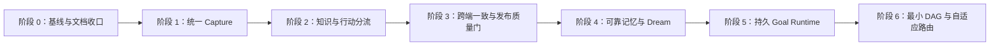

# Bob 下一阶段演进路线图

> 状态：已确认，执行中
> 制定日期：2026-08-09
> 依据：`docs/PRODUCT_VISION.md`
> 范围：从当前 v0.7.8 基线推进到可靠的统一入口、跨端一致、长期记忆与 Goal Runtime
> 原则：Capture 基座优先；发布稳定是每阶段质量门；Goal 不建立在不一致的数据入口之上。

## 1. 本轮要解决的核心问题

Bob 已经拥有聊天、文章收藏、笔记、待办、日程、知识图谱、移动分享、跨端同步、记忆和 Goal Loop 原型，但这些能力尚未形成一个稳定的产品闭环：

- 不同入口使用不同处理路径，同一内容可能得到不同结果；
- Source、Knowledge、Seed、Todo、Event、Goal 尚无统一入口契约；
- Android 分享、聊天收藏和快捷笔记的加工深度与同步结果不完全一致；
- 同步链路已有诊断能力，但仍需真实双端验证、体积回归和发布收口；
- Dream 和 Evolution 读取的数据路径与证据并不完全统一；
- Goal Runtime 已有目标设计，但不能先于可靠输入、持久状态和跨端一致性大规模建设；
- `todo.md` 混有历史日志、重复目标和过期方案，不能继续作为唯一的开发排序依据。

## 2. 路线选择

采用 **基础闭环优先** 路线：

1. 先冻结当前质量基线；
2. 建立统一 Capture 契约；
3. 打通知识、灵感、待办、日程的可靠分流；
4. 保证 PC 与 Android 结果一致且可诊断；
5. 让 Memory 与 Dream 基于可靠证据学习；
6. 最后接入持久 Goal Runtime、最小 DAG 和结果驱动学习。

不采用以下路线：

- **Goal 优先**：展示速度快，但会把复杂执行建立在不一致的入口和同步之上，返工风险高；
- **纯修补优先**：短期稳定，但继续沿用分散的数据路径，无法形成 Bob 的长期差异化。

## 3. 总体阶段与依赖

阶段必须按依赖推进。可以在同一阶段内并行开发互不依赖的任务，但不得为了展示多 Agent 或 DAG 而跨越前置质量门。

## 4. 阶段 0：冻结真实基线

### 目标

先回答“Bob 现在真实能做什么、哪些路径可靠、哪些只是文档声明”，为后续改动建立可重复验证的基线。

### 工作项

- 为聊天收藏、网页提取、快捷笔记、日程、待办、Android 分享和同步建立端到端场景清单；
- 完成 Relay V2 尚未关闭的真实双端验证、故障注入和 trace 对账；
- 记录 PC 主程序、绿色包、安装器和 Android APK/AAB 当前字节数；
- 确认生产 Relay 的部署版本、进程守护和协议兼容状态；
- 将 `todo.md` 中历史日志和已完成长记录迁移到归档，识别重复编号和过期方案；
- 校正 `progress.yaml`：True Goal Runtime 在 Capture 基座完成前标记为后续主线，而非当前执行阶段。

### 完成门槛

- 每条核心用户路径都有可复现的成功与失败样例；
- 双端日志能以同一 `trace_id/sync_id` 对账；
- 客户端体积具有可比较基线；
- 文档不会把规划中能力写成已完成。

## 5. 阶段 1：统一 Capture 基座

### 目标

让用户无论从聊天、快捷笔记、网页收藏、Android 分享、文件或图片进入，Bob 都通过同一条可追踪的理解管线处理。

### 核心设计

建立版本化 `CaptureEnvelope`，至少包含：

- `capture_id`、来源设备、入口类型和创建时间；
- 原始文本、URL、文件或图片引用；
- 用户原话与显式意图；
- 内容哈希、来源信息和处理状态；
- 语言、隐私范围和同步范围；
- 幂等键、错误阶段和重试信息。

所有入口只负责产生 Envelope，不各自决定最终写入知识库、日历或待办。

### 工作项

- 盘点并收口聊天收藏、`save_to_notes`、快捷笔记和 Android Share 的入口；
- 统一网页正文提取、来源保存和失败降级；
- 建立 `received → extracting → classifying → committing → synced/failed` 状态；
- 保留原始来源，派生结果只引用来源，不复制无来源文本；
- 以 `capture_id + content_hash` 保证重复分享和断线重试不会重复入库；
- 用户日志显示“收到什么、正在处理什么、保存到哪里、哪里失败”。

### 产品约束

- 不增加 PC 或 Android 用户侧运行时；
- 构建期工具不得进入客户端运行依赖；
- 简单文本捕获必须快速完成，不能强制调用昂贵模型；
- 网络或模型失败时保留原始输入，允许稍后继续处理。

### 完成门槛

- 同一测试内容从三个不同入口进入，得到等价的原始来源和处理状态；
- 重复提交和重试不会产生重复记录；
- 中途退出或断网不会丢失输入；
- PC 与 Android 都能看到处理结果或准确失败阶段。

## 6. 阶段 2：知识与行动可靠分流

### 目标

把一次自然输入可靠地转化为一个或多个用户可理解、可纠正的结果。

### 统一分类

| 类型 | 含义 | 核心区别 |
|---|---|---|
| Source | 原始文章、网页、文件或消息 | 保留来源，不代表用户观点 |
| Knowledge | 从 Source 提炼的可复用知识 | 可追溯到证据 |
| Seed | 尚未要求执行的灵感 | 不自动变成待办 |
| Todo | 需要完成但无固定时间段的事项 | 进入待办区 |
| Event | 在特定日期或时间发生的安排 | 进入日历 |
| Routine | 重复触发的习惯或流程 | 具有触发规则 |
| Goal | 需要持续、可恢复、可验证执行的目标 | 后续交给 Goal Runtime |

### 工作项

- 设计结构化分类结果，支持一次 Capture 生成多个派生对象；
- 修正 Todo 与 Event 的时间语义，禁止用午夜时间把普通待办伪装成日程；
- 对低置信度分类采用低干扰确认，不把内部模式暴露给用户；
- 提供一次点击纠正入口，纠正结果写入最高优先级记忆；
- 事务提交：要么来源和派生对象一致成功，要么进入可恢复状态；
- 文章收藏默认形成 Source 与 Knowledge，不将文章观点直接写成用户偏好。

### 完成门槛

- 标准回放集能稳定区分 Knowledge、Seed、Todo、Event 和 Goal 候选；
- 一条包含文章、会议时间和后续动作的输入可以生成多个正确结果；
- 用户纠正后，相同表达不再重复犯同类错误；
- 日历和待办在 PC、Android 上进入正确区域。

## 7. 阶段 3：跨端一致与发布质量门

### 目标

让 PC 和 Android 成为同一个 Bob，而不只是两个能够交换数据库片段的客户端。

### 工作项

- 以领域对象和版本事件同步 Capture、Source、Knowledge、Seed、Todo、Event 和处理状态；
- 明确每类对象的冲突策略、删除语义和主控端规则；
- 完成 Android 系统分享闭环，构建期注入不得变成用户侧 Python 依赖；
- 双端统一展示最近一次实际同步、待同步数量和失败阶段；
- 使用真实 LAN、不同 Wi-Fi、移动网络、Relay 中断和应用重启场景验证；
- 将 PC/绿色包/安装器/APK 体积回归设为发布阻断门。

### 完成门槛

- 手机分享文章后，PC 能看到同一来源、提炼结果和处理状态；
- PC 创建或纠正待办、日程后，手机得到一致结果；
- 乱序、重复、离线和重连不会造成重复对象或静默覆盖；
- 用户能够区分“设备在线”“Relay 可达”“对端可达”和“数据已同步”；
- 客户端无未解释的体积或依赖增长。

## 8. 阶段 4：可靠记忆与 Dream

### 目标

让 Bob 从用户行为和真实结果中逐渐学习，同时避免把偶然内容、工具错误或文章观点固化成用户人格。

### 工作项

- 统一 Dream、Evolution、Notebook、Source 和工作区路径；
- 记忆按 identity、preference、episodic、procedural、project、correction 分层；
- 每条长期记忆保留 scope、source、confidence、evidence、version 和有效期；
- Dream 负责未处理 Capture 修复、去重、主题巩固、冲突和过期检查；
- 单次收藏只产生 episodic 信号，重复且稳定的行为形成 preference candidate；
- 高敏感或影响明显的画像推断必须请求用户确认；
- 提供查看、纠正、删除和导出记忆的最小用户入口。

### 完成门槛

- Bob 可以回答“为什么认为我有这个偏好”，并展示证据；
- 用户纠正不会被 Dream 衰减、覆盖或再次推断回来；
- Dream 处理后知识更整洁，失败输入更少，而不是只多一份摘要；
- 记忆召回能减少重复澄清，并通过回放测试证明没有明显增加误导。

## 9. 阶段 5：持久 Goal Runtime

### 目标

在可靠 Capture、分类、同步和记忆之上，让复杂请求成为可暂停、可恢复、可验证的持续目标。

### 工作项

- 冻结 `IntentDecision`、`GoalContract`、状态、证据和事件契约；
- 建立 Answer、QuickAction、PlannedTask、Goal、Routine 回放集；
- 实现 Goal Compiler 和自动升级判断；
- 持久化 Goal、Attempt、Evidence、Event 和 Checkpoint；
- 支持暂停、继续、取消、预算耗尽、等待用户和应用重启恢复；
- Done 必须绑定证据，缺少证据保持 `unverified`；
- Goal 状态同步到 Android，但不得重复执行有副作用的节点。

### 完成门槛

- 普通用户无需理解或手动选择 Goal 模式；
- 应用重启和手机断线后可安全恢复；
- 每个完成与阻塞状态都能说明证据或缺口；
- R0–R3 权限边界保持有效；
- 不增加客户端外部运行时。

## 10. 阶段 6：最小 DAG、局部恢复与自适应路由

### 目标

让真正存在依赖或可并行的复杂目标得到结构化执行，而不是把所有任务都包装成多 Agent。

### 工作项

- 支持顺序、独立并行和汇合三种最小关系；
- 独立节点使用干净上下文，依赖节点只继承相关产物与证据；
- 节点声明工具、模型、视觉、风险、验证、重试和降级需求；
- 失败只重试受影响节点并使相关下游失效；
- 根据历史成功率、成本和时延选择模型与策略；
- 只有数据证明并行有收益后才扩展多 Agent，且设置资源和预算上限。

### 完成门槛

- 可以精确说明任务为何被拆分、哪些节点依赖前序结果；
- 局部失败不会无差别重跑整项 Goal；
- 模型路由有真实结果依据，而不是固定地把“强模型”用于所有复杂请求；
- 用户只看到目标、进度、需要的决定和结果，不必管理 DAG。

## 11. 跨阶段质量门

每一阶段都必须同时满足：

- **真实行为**：文档声明与代码、数据库和 UI 一致；
- **故障可恢复**：模型、网络、工具、进程和同步失败都有明确状态；
- **用户可理解**：普通日志说明发生了什么，高级 trace 不污染普通界面；
- **隐私与权限**：无越权写入、敏感推断或凭证泄露；
- **跨端一致**：涉及用户数据的功能必须定义 PC/Android 行为；
- **依赖与体积**：记录新增依赖和产物尺寸，异常增长阻断发布；
- **回归验证**：单元测试、契约测试、场景回放和必要的真实设备测试通过；
- **文档同步**：更新 `ARCHITECTURE.md`、`LLM_WIKI.md`、`todo.md`、`progress.yaml` 和用户文档中的对应真相源。

## 12. 第一批可执行任务

路线图确认后，先建立以下任务，不立即展开 Goal DAG：

1. **R0-01 现状回放集**：建立聊天收藏、快捷笔记、Android 分享、Todo、Event 和同步的基线场景。
2. **R0-02 发布基线**：完成 Relay 双端 trace 对账和四类客户端产物体积记录。
3. **R0-03 文档清债**：归档 `todo.md` 历史日志、合并重复目标、修正过期的 Android 分享与同步方案。
4. **R1-01 CaptureEnvelope 契约**：定义版本化 Rust/JS 数据结构、状态和错误阶段。
5. **R1-02 入口适配审计**：列出聊天、Link Harvester、Quick Note、Android Share 当前入口和写入路径。
6. **R1-03 Capture Journal**：先实现持久接收、幂等和失败恢复，再迁移各入口。
7. **R1-04 三入口纵切片**：用一条网页内容贯通聊天收藏、快捷笔记和 Android 分享，比较最终结果。

第一批任务完成后，再决定阶段 2 的分类器是否采用规则优先、单模型结构化分类或混合策略。

## 13. 暂缓事项

在阶段 1–3 完成前暂缓：

- 多 Agent 并发编排；
- 大规模 Goal DAG UI；
- 新增更多通讯渠道；
- iOS 和独立 Web UI；
- 手机端大型本地模型；
- 为展示能力而增加新的文档、表格或演示型工具；
- 无法证明用户价值却显著增加安装体积的依赖。

这些事项不是永久取消，而是避免分散当前产品闭环。

## 14. 路线图维护规则

- 本文件定义阶段顺序与完成门槛，不保存每日开发日志；
- `todo.md` 保存当前阶段的可执行任务及验收条件；
- `progress.yaml` 保存机器可读的 `done/active/todo` 状态；
- `docs/ARCHITECTURE.md` 只记录当前真实实现；
- `docs/GOAL_RUNTIME.md` 继续作为 Goal 专题目标架构；
- 改变目标客户、核心痛点或低摩擦战略原则时，先回到 `PRODUCT_VISION.md` 取得用户确认。
