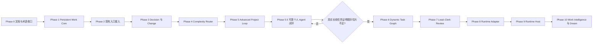

# Bob 演进路线图

> 状态：v0.9.3 已完成 Phase 0–5 与 Phase 5.5 内部可靠闭环；当前主线为真实 PC/Android 场景和资源质量门
> 产品北极星：`docs/PRODUCT_VISION.md`
> Phase 5.5 设计：`docs/BOB_ARCHITECTURE_V3.md`
> 当前实施计划：`docs/superpowers/plans/2026-08-15-phase-5-5-reliable-personal-agent-loop-plan.md`

## 当前基线

`v0.8.0` 已封存可靠 Capture、知识对象契约、离线分类、Todo/Event 确定性提交和 Note/Source Markdown 提交基线。它是不可修改的历史版本。

当前已完成 Persistent Work Core、现有入口接入、Decision/Change Review、Complexity Router，以及单 Agent Advanced Project Loop 的可靠纵切片：Auto Advanced 可建立持久 Goal，低风险工作按预算推进，审批、证据、检查点和启动恢复均写入 SQLite。Conversation-first Today Layer 已将 Calendar、Todo、Work、Goal、Session 与 Dream 以本地只读方式投影进对话首屏。Phase 5.5 的内部可靠闭环也已落地：Goal Runtime 会消费确定性解析后的 Project，Capability Snapshot 与工具表求交集，Action Selector 只允许本地执行、PC 转交、询问或延后，错误按类别有界恢复，Direct/Advanced 都返回 ResultReceipt；Dream 不再修改 SOUL，验证成功只形成待审阅经验候选。当前仍缺少：

- 用真实 PC Work Core 数据通过误选门后，关闭默认 shadow 并正式注入唯一高置信度 Context Packet；
- 完成 PC/Android 真机、安装体积、冷启动与资源质量门，确认能力快照和跨端转交在真实设备稳定；
- 用真实长线任务数据评估 ResultReceipt、经验候选和恢复策略是否真正减少用户重复说明与人工接管；
- Dynamic Task Graph 与节点级局部恢复；
- 可替换 Agent Runtime 和结果驱动 Dream。

## 路线与依赖

不得为了展示多 Agent 或订阅调度而跨越前置质量门。API-only 环境必须始终能够运行完整核心框架。

## 已完成实施批次：Phase 0–4

### Phase 0：Re-anchor

- [x] 统一产品愿景、术语和文档职责；
- [x] 建立架构 Decision Log；
- [x] 明确 Bob Core、Orchestration、Runtime 和 Integration 边界；
- [x] 让 `todo.md` 与 `progress.yaml` 只展示当前真实主线。

### Phase 1：Persistent Work Core

- [x] 建立 Project、Responsibility、Goal、Milestone、Task、Decision、Artifact、Evidence、Risk、Change、Commitment 基础契约；
- [x] 建立 SQLite Repository、事务、幂等、revision、软删除和 append-only Work Event Journal；
- [x] 聚合项目目标、阶段、任务、决定、风险、变化与下一步；
- [x] 兼容现有 Markdown Project 稳定 ID，不迁移真实数据；
- [x] 生成可迁移 Markdown 项目快照；
- [x] 建立 Project/Goal/Task/Decision 最小 Bridge 和 UI；
- [x] 验证新会话恢复、重启恢复和事务回滚；
- [ ] 在下一次 PC/Android 发布产物上完成体积变化与真机 UI 验收。

### Phase 2：现有入口接入

- [x] 明确项目任务、Decision、Commitment 和会议派生项事务性写入 Project State；
- [x] Todo/Event 保留 Calendar 真相源并建立 Task/Milestone 稳定引用；
- [x] Note/Source 保留 Markdown 真相源，支持单项目归属与多项目知识引用；
- [x] 文件保留原位置，只登记路径、流式 hash、大小、mtime 与 Artifact 引用；
- [x] 同路径内容变化生成待确认 Change，不自动修改既有 Decision；
- [x] 项目歧义和缺字段进入 WorkView 待归属区，不使用阻断弹窗；
- [x] 外部 Todo/Event 状态变化追加 Work Event，Project 不复制其状态。

### Phase 3：Decision Memory 与 Change Review

- [x] Decision 保存决定、理由、备选、被否决方案、参与者、负责人、证据和重访条件；
- [x] 旧 Decision 数据保持兼容，写入时统一清理空值与重复列表；
- [x] 同路径文件 hash 变化时保留旧 Artifact，并创建新版 Artifact 与 Change；
- [x] 根据显式关系、Decision evidence、旧 Artifact 和验证过的对象 ID 生成影响 Review；
- [x] 无证据时显示“影响范围未知”，不假装没有影响；
- [x] 用户可接受、拒绝或延后；只有接受后才建立影响、冲突或替代关系；
- [x] 所有 Review 变化进入 Work Event，Markdown 快照展示完整 Decision 和待确认 Change。

### Phase 4：Complexity Router

- [x] 独立 Rust 契约返回 Direct、Deep、Advanced、task kind、置信度、风险、持续性和原因代码；
- [x] 确定性信号优先，只有真正模糊的语义才限时调用 Clerk；失败或断网保守只读降级；
- [x] 复杂只读分析只获得 R0 工具，路由和用户覆盖都不能绕过 R2/R3 Policy Engine；
- [x] Auto Advanced 不进入旧 Goal Loop，只做有边界的启动且禁止虚假完成；
- [x] 建立 30+ 个中英文回放场景，覆盖问答、单步动作、复杂分析、批处理、持续任务、重复日程和长文本；
- [x] 回复显示低干扰路由标签，Goal 覆盖入口明确标为不可恢复的实验原型。

## 后续阶段摘要

| 阶段 | 用户价值 | 完成信号 |
|---|---|---|
| Phase 2（完成） | 所有输入更新同一个项目现实 | Capture、Note、Source、Todo、Event、File 可追溯关联 Project |
| Phase 3（完成） | Bob 知道什么改变了什么 | 新文件能指出受影响决定、证据和待确认变化 |
| Phase 4（完成） | 用户无需选择复杂模式 | 简单请求保持轻量，持续工作识别为 Advanced 且不虚假完成 |
| Phase 5（完成首个纵切片） | 复杂目标可以中断恢复 | 具备安全恢复、审批持久化与 Evidence gate；完整回归持续通过 |
| Phase 5.5 | 用户主要说目的，Bob 恢复上下文并选择真实可用的最轻路径 | 五个日常场景通过；不会选错项目、调用不存在能力、污染长期人格或伪造完成 |
| Phase 6 | 多阶段工作局部恢复 | 节点失败只影响其下游，计划允许重构 |
| Phase 7 | 专业角色提高可靠性 | 多角色有可量化收益，而非 Agent 表演 |
| Phase 8 | 模型与执行器可替换 | 更换 Runtime 不丢 Project State |
| Phase 9 | 可选复用订阅和远程算力 | Host 离线不影响 Bob Core |
| Phase 10 | 越用越懂且可纠正 | 主动建议引用事实和偏好证据 |

## 发布质量门

- `v0.8.x`：新路线规划、现有基线修复，不宣称 Persistent Work Core 完成；
- `v0.9.0`：Persistent Project State、Decision 与最小 Project UI；
- `v0.10.0`：现有入口接入 Work Core 与 Change Detection；
- `v0.11.0`：Complexity Router 与单 Agent Advanced Project Loop；
- 后续版本只有通过对应阶段验收才命名。

每阶段必须覆盖状态机、幂等、事务、暂停恢复、证据缺失、权限、同步兼容和客户端体积回归。
