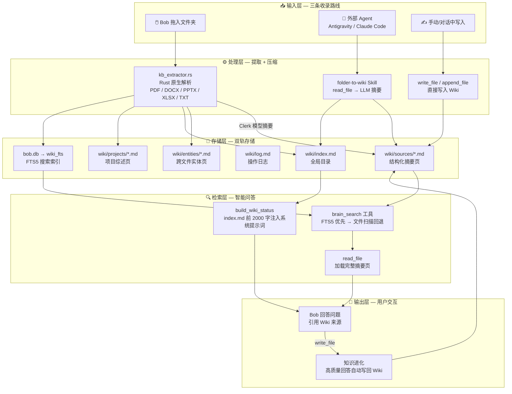

# Bob-Agent 知识库架构全景图

## 一、总览

Bob-Agent 的知识库是一个 **LLM-Wiki** 系统：不切碎原始文档（RAG），而是预先将文件内容**编织**成结构化的 Markdown 知识页，再通过双层索引（Markdown 目录 + SQLite FTS5）实现高速检索。



---

## 二、收录阶段（Ingest）

### 路线 A：Bob-Agent 内化管道（拖入文件夹）

用户体验：拖入文件夹 → 看到费用预估 → 点击"开始构建" → 后台静默处理 → 完成通知

```
用户拖入文件夹
     │
     ▼
┌─────────────────────────────┐
│  system_estimate_kb()       │  ← Rust, 不提取文本, 只统计
│  扫描文件数、类型、体积      │
│  估算 Token 数和费用         │
└────────────┬────────────────┘
             │ 前端显示 KBEstimateCard
             ▼
     用户点击 "开始构建"
             │
             ▼
┌─────────────────────────────┐
│  system_build_kb()          │  ← 异步 Tauri Command
│                             │     不阻塞主聊天
│  for each file:             │
│    ① kb_extractor 提取文本  │  ← Rust 原生, 无 Python
│    ② 调用 Clerk 模型        │  ← 牛马模型, 低成本
│    ③ 写入 wiki/sources/     │  ← Markdown 知识页
│    ④ INSERT wiki_fts        │  ← FTS5 搜索索引
│    ⑤ 更新 index.md          │  ← 全局目录
│    ⑥ 发送 kb:progress 事件  │  ← 前端实时进度
│                             │
│  生成 projects/ 综述页      │
│  追加 log.md 操作记录       │
└────────────┬────────────────┘
             │
             ▼
    前端显示 "✅ 完成, 已处理 N 个文件"
    用户可以立刻提问
```

**关键特性**：
- Clerk 模型在 Tokio 后台线程运行，用户可以**同时**和主模型聊天
- 如果 Clerk 未配置，直接报错提醒
- 进度通过 Tauri Event (`kb:progress`) 实时推送

### 路线 B：外部 Agent（Antigravity / Claude Code）

用户体验：对 Agent 说"把 XXX 目录收录进知识库"

```
用户指令："把 D:\Documents\Public_Policy 收录进知识库"
     │
     ▼
Agent 匹配 folder-to-wiki Skill
     │
     ▼
┌─────────────────────────────┐
│  Step 1: 扫描目录            │  ← list_dir / 系统命令
│  Step 2: 逐文件 read_file   │  ← Agent 自身读取
│  Step 3: Agent 自身做摘要    │  ← 利用订阅额度, 免费
│  Step 4: write_file 写入 Wiki│  ← 写入同一棵 Wiki 树
└─────────────────────────────┘
```

**优势**：用 Antigravity/Claude Code 的订阅额度做摘要，不消耗 Clerk 模型的 API 费用。

### 路线 C：对话中自然积累

Bob 在日常对话中产出高质量分析时，被系统提示词引导**主动**调用 `write_file` 保存到 Wiki。

```
用户："帮我对比 React 和 Vue 的优缺点"
     │
     ▼
Bob 生成深度对比分析
     │
     ▼ (系统提示词引导)
Bob 调用 write_file("wiki/sources/react_vs_vue.md", ...)
     │
     ▼
知识自动沉淀到 Wiki, 下次再问直接命中
```

---

## 三、存储层

### Markdown Wiki（人类可读层）

```
data/wiki/
├── index.md              ← 全局目录, 注入系统提示词 (前 2000 字)
├── log.md                ← 操作日志, append-only
├── sources/              ← 每文件一页结构化摘要
│   ├── 个税改革分析.md
│   ├── react_vs_vue.md
│   └── ...
├── entities/             ← 跨文件提取的实体/概念
│   ├── 双减政策.md
│   └── ...
└── projects/             ← 按文件夹粒度的综述
    └── Public_Policy.md
```

每个 Source 页面的标准格式：
```markdown
---
source: D:\Documents\Public_Policy\个税改革.pdf    ← 绝对路径
type: pdf
tags: [税收, 个税, 专项扣除]
indexed_at: 2026-05-16 00:35
---

# 个税改革分析

## 摘要
2024年个税改革的核心变化包括六项专项扣除额度上调...

## 关键数据点
- 专项扣除总额上限从 12 万提至 18 万
- 预计减税规模 3200 亿元
```

### SQLite FTS5（机器检索层）

```sql
-- 与 Markdown 完全同步的搜索索引
wiki_fts 表:
┌──────────────────┬──────────────────────────────┬──────────────────────┐
│ file_name        │ source_path                  │ wiki_path            │
├──────────────────┼──────────────────────────────┼──────────────────────┤
│ 个税改革分析      │ D:\...\个税改革.pdf           │ wiki/sources/个税...  │
│ react_vs_vue     │ (对话生成)                    │ wiki/sources/react.. │
└──────────────────┴──────────────────────────────┴──────────────────────┘
+ summary (摘要全文) + keywords (关键词) + category (分类)

查询: MATCH '减税 OR 税收' → 毫秒级返回 Top 10
```

**两层关系**：Markdown 是"真相源"，FTS5 是"加速器"。即使 FTS5 表丢失，从 Markdown 文件可以随时重建。

---

## 四、检索阶段（Query）

用户提问时，Bob 有**两个信息通道**同时工作：

### 通道 1：系统提示词被动注入（每次对话自动生效）

```
每次 LLM 调用
     │
     ▼
build_wiki_status()
     │
     ▼
读取 index.md 前 2000 字符
     │
     ▼
注入 System Prompt:
"## 知识库目录概览
- [个税改革分析](sources/个税...) — 六项专项扣除...
- [react_vs_vue](sources/react...) — 框架对比分析...
..."
```

LLM 看到目录后，如果用户的问题与某个条目相关，会**主动**调用 `brain_search` 或 `read_file` 深入查阅。

### 通道 2：brain_search 主动检索

```
LLM 判断需要查知识库
     │
     ▼
调用 brain_search("双减政策")
     │
     ├─ 优先: FTS5 MATCH 查询 ──→ 毫秒返回
     │        {file_name, source_path, wiki_path, summary}
     │
     └─ 回退: 遍历 wiki/*.md 文本匹配 (FTS5 为空时)
     │
     ▼
LLM 拿到 wiki_path
     │
     ▼
调用 read_file("wiki/sources/双减政策.md")
     │
     ▼
获得完整摘要页内容, 用于回答用户
```

### 完整问答流程

```
用户: "双减政策对K12市场的影响有多大?"
  │
  ▼ System Prompt 中已有 index.md 概览
  │
  ▼ Bob 发现 "公共政策" 相关条目
  │
  ▼ brain_search("双减 K12") → FTS5 命中 "双减政策影响评估"
  │
  ▼ read_file("wiki/sources/双减政策影响评估.md")
  │
  ▼ Bob 综合 Wiki 知识 + 自身能力回答:
    "根据我的知识库记录（来源: D:\...\双减.pdf），
     K12 课外培训市场萎缩了 78%，
     涉及 3.2 万家机构关停..."
```

---

## 五、进化阶段（Evolve）

知识库不是静态的。它通过三种方式持续进化：

| 方式 | 触发条件 | 效果 |
|------|---------|------|
| **增量收录** | 用户拖入新文件夹 / 外部 Agent 收录 | Wiki 页面增加 |
| **对话沉淀** | Bob 产出高质量分析时主动写入 | 知识从聊天→持久化 |
| **交叉引用** | (规划中) 实体页自动合并同名引用 | 知识网络化 |

---

## 六、文件与模块速查

| 模块 | 路径 | 职责 |
|------|------|------|
| [kb_extractor.rs](file:///d:/OneDrive/Learning/Code/Gemini/bob-agent/src-tauri/src/kb_extractor.rs) | Rust | 原生文件解析 (PDF/Word/Excel/PPT) |
| [kb_indexer.rs](file:///d:/OneDrive/Learning/Code/Gemini/bob-agent/src-tauri/src/kb_indexer.rs) | Rust | Clerk 摘要 + Wiki 写入 + FTS5 同步 |
| [tools.rs](file:///d:/OneDrive/Learning/Code/Gemini/bob-agent/src-tauri/src/tools.rs) (brain_search) | Rust | FTS5 搜索 + 文件扫描回退 |
| [tools.rs](file:///d:/OneDrive/Learning/Code/Gemini/bob-agent/src-tauri/src/tools.rs) (append_file) | Rust | Wiki 安全追加工具 |
| [llm.rs](file:///d:/OneDrive/Learning/Code/Gemini/bob-agent/src-tauri/src/llm.rs) (build_wiki_status) | Rust | 系统提示词注入 Wiki 概览 |
| [lib.rs](file:///d:/OneDrive/Learning/Code/Gemini/bob-agent/src-tauri/src/lib.rs) (wiki_fts) | Rust | FTS5 表初始化 |
| [tauri-bridge.js](file:///d:/OneDrive/Learning/Code/Gemini/bob-agent/src/tauri-bridge.js) | JS | IPC 桥接 + KB 事件监听 |
| [ChatView.vue](file:///d:/OneDrive/Learning/Code/Gemini/bob-agent/src/views/ChatView.vue) | Vue | 进度条 UI + 非阻塞构建 |
| [folder-to-wiki SKILL](file:///D:/OneDrive/Learning/Code/Gemini/Assistant/common/knowledge/skills/folder-to-wiki/SKILL.md) | Skill | 外部 Agent 收录指南 |
