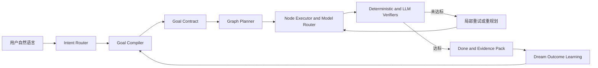

# Bob Goal Runtime 与个性化进化架构

> 状态：目标架构（尚未全部实现）  
> 更新：2026-08-09  
> 权责：本文件是 Goal、任务 DAG、验证闭环和 Dream 学习边界的单一真相源；任务状态以 `todo.md` 和 `progress.yaml` 为准。

## 1. 产品终局

Bob 是一个**零设置、隐私优先、跨设备、持续理解用户的个人执行系统**：用户只需表达意图，Bob 负责把它转化为安全、可恢复、可验证的结果。

Bob 不以复制 Codex 的编程深度或 Claude Code 的终端能力为目标。核心竞争力是：

- PC 安装版和绿色版零外部运行时，Android 不新增用户侧依赖；
- 普通白领无需理解模型、MCP、上下文或 Agent 编排；
- 自动判断回答、快速操作、计划任务、持久 Goal 和定时任务；
- 任务可暂停、恢复、追踪、验证，失败可定位并局部重试；
- 在用户可查看、纠正和删除的前提下，从结果与反馈中持续学习。

北极星指标：**经用户认可且证据可查的任务闭环率**。辅助指标包括澄清次数、Goal 恢复成功率、失败定位率、无效重试率、记忆纠正率和客户端体积变化。

## 2. 当前能力边界

当前 `goal.rs` 已实现 Maker–Checker 原型：Goal 模式提供较高工具预算，先运行确定性断言，再由 Clerk 判断 PASS/FAIL，最多执行三轮外层重试。

这不是完整 Goal Runtime，当前缺口包括：

- Auto 意图分类不会自动升级到 Goal；
- 原始用户消息尚未编译为结构化 Goal Contract；
- 没有持久化的 Goal、节点、依赖、证据和检查点；
- 没有真正的执行 DAG、节点级验证和局部恢复；
- 重启、跨端或上下文压缩后不能可靠续跑；
- Dream 尚未使用完整 Goal 轨迹学习用户偏好和有效策略。

对外文档必须将当前能力称为“Goal Loop 原型”，直到本文件的完成门槛全部满足。

## 3. 统一概念

| 概念 | 职责 | 不负责 |
|---|---|---|
| Intent Router | 判断 Answer、Quick Action、Planned、Goal、Routine | 执行任务 |
| Goal Compiler | 将自然语言编译为可验证合约 | 编写每一步微操作 |
| Goal Runtime | 保存状态、预算、权限、恢复与终止条件 | 生成知识关系 |
| Graph Planner | 生成任务节点、依赖和并行关系 | 保存用户人格 |
| Executor/Router | 为节点选择模型、工具和执行环境 | 宣布整项 Goal 完成 |
| Verifier | 根据证据判断节点与 Goal 是否达标 | 仅凭执行者自述通过 |
| Knowledge Graph | 保存实体与语义关系 | 充当执行 DAG |
| Dream/Memory | 从事实、反馈和结果中形成长期记忆 | 直接控制不可逆操作 |

## 4. 目标运行流

### 4.1 自动模式

默认 UI 只暴露 Auto。系统内部分类为：

1. `Answer`：解释或查询，不提供写工具。
2. `QuickAction`：单步、低风险、可撤销。
3. `PlannedTask`：当前会话内的有限多步骤任务。
4. `Goal`：具有可验证终态，需要持续执行、恢复或较长预算。
5. `Routine`：按时间或事件触发。

高级入口保留“只回答”“帮我完成”和“停止”，但普通用户不需要手动选择 Goal。

### 4.2 Goal Contract

每个 Goal 至少包含：

- `outcome`：期望终态；
- `evidence`：完成证据与验证器；
- `scope`：允许操作的对象与路径；
- `constraints`：禁止事项；
- `milestones`：高层状态节点；
- `budget`：时间、Token、工具调用和重试上限；
- `risk_policy`：R0–R3 权限边界；
- `blocker_policy`：允许打断用户的条件；
- `handoff`：暂停、重启与跨端恢复信息。

系统可以根据明确的用户记忆补全低风险偏好；缺少凭证、存在不可逆风险或业务选择互斥时必须询问用户。

### 4.3 DAG 与上下文

- 独立节点使用干净上下文，只接收 Goal Contract、节点输入和相关记忆；
- 依赖节点接收前序节点的结构化产物与证据，不继承全部聊天历史；
- 协调器维护全局状态，节点通过 artifact 引用交换信息；
- 失败只重跑受影响节点及其下游；
- 并行仅用于无依赖且资源允许的节点，不以 Agent 数量作为能力指标。

### 4.4 验证顺序

1. 确定性检查：状态码、测试、Schema、计数、文件或数据库状态；
2. 业务规则与约束检查；
3. Rubric/Clerk 评价；
4. 高风险或主观交付物的用户验收。

执行者不能单方面宣布完成。证据不足应保持 `unverified`，不能推断为成功。

## 5. 持久状态模型

目标 Schema 应至少覆盖：

- `goals`：合约、状态、预算、风险、创建与截止时间；
- `goal_nodes`：节点输入、产物、执行器、验证器与状态；
- `goal_edges`：依赖关系；
- `goal_attempts`：每次执行和错误；
- `goal_evidence`：验证证据及来源；
- `goal_events`：可审计状态流；
- `goal_checkpoints`：恢复快照。

标准状态：`draft → ready → running → waiting_user/blocked → verifying → done/failed/cancelled`。

只有满足以下条件才能称为产品级 Goal：

- 应用重启后可恢复未完成目标；
- 可以查看完成条件、当前节点、预算和最近一次验证原因；
- 失败能够定位到节点和验证规则；
- Done 必须绑定证据；
- 取消、超预算和阻塞具有明确终态；
- R2/R3 操作继续受 Policy Engine 约束。

## 6. Dream 与用户模型

SOUL 只保存稳定身份与交互原则，禁止混入工具错误和临时项目事实。长期记忆分为：

- `identity`：稳定身份和环境；
- `preference`：风格、选择、容忍度和工作习惯；
- `episodic`：任务轨迹、决定、结果和反馈；
- `procedural`：对特定任务有效的工具、模型与策略；
- `project`：项目局部状态与约束；
- `correction`：用户明确纠错，最高优先级。

每条记忆必须保留 scope、source、confidence、evidence、version，并逐步增加有效期、使用次数、成功相关性、敏感级别和用户确认状态。

Dream 的学习输入应是：原始目标、Goal Contract、计划、执行轨迹、验证结果、用户修改与最终验收。推断记忆只有积累足够证据后才提升置信度；用户明确表达的偏好和纠错立即生效，但始终可查看、编辑和删除。

执行失败应写入 procedural memory 或诊断库，不得写入 SOUL。

## 7. 开发顺序与非目标

严格按以下顺序推进：

1. Goal Contract 与自动路由；
2. 持久 Goal Runtime；
3. 最小 DAG、节点上下文和局部恢复；
4. Goal 轨迹接入 Dream；
5. 基于历史成功率的模型与策略路由；
6. 数据证明有收益后再扩展多 Agent 并行。

当前非目标：

- 不为追求“多 Agent”而增加常驻服务或客户端依赖；
- 不把纯提示词包装成已完成的 Runtime；
- 不让 LLM 自评替代确定性验证；
- 不把所有请求都升级为 Goal；
- 不以牺牲安装包尺寸、绿色运行或 Android 依赖约束换取编排能力；
- 不默认要求用户配置 MCP。

## 8. 质量门槛

每个阶段都必须提供：

- 单元测试：状态机、路由、预算、依赖归约与记忆冲突；
- 集成测试：暂停恢复、失败定位、局部重试和权限确认；
- 回放集：Answer/Action/Planned/Goal/Routine 分类与 Goal Contract 质量；
- 故障注入：模型超时、工具失败、进程重启、网络中断和证据缺失；
- 体积回归：PC 安装版、绿色版和 Android APK 不出现未解释增长；
- 可观测性：用户日志与高级诊断分层，用户记录保持有限数量。

