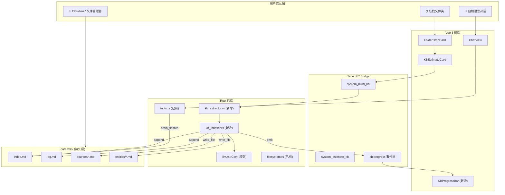
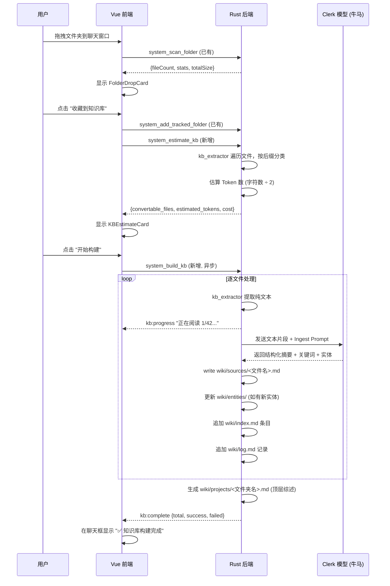

# Bob-Agent LLM-Wiki 知识管理系统 — 完整架构蓝图

> 将 iknow 项目的 LLM-Wiki 范式移植到 Bob-Agent，让一个 Rust 桌面应用具备完整的本地文件理解和知识织网能力。

---

## 一、全景架构



---

## 二、三层数据架构 (来自 LLM-Wiki 理论)

| 层 | 路径 | 所有权 | 说明 |
|---|---|---|---|
| **原始源 (Raw)** | 用户磁盘上的任意文件夹 | 用户 | 绝对只读。Bob 永远不修改用户的原始文件。通过 `trackedFolders` 记录路径。 |
| **Wiki 层** | `{data_dir}/wiki/` | Bob (LLM) | Bob 全权维护的 Markdown 知识网。包含摘要页、实体页、全局索引和操作日志。 |
| **Schema 层** | `llm.rs` 系统提示词 + `skills/` | 开发者 | 告诉 Bob 如何维护 Wiki 的铁律：命名规范、索引格式、交叉引用规则。 |

### Wiki 目录拓扑

```
data/wiki/
├── index.md              ← 全局目录，LLM 查询入口
├── log.md                ← 时间轴操作日志 (append-only)
├── sources/              ← 每个被摄入的文件的结构化摘要
│   ├── 公共政策白皮书.md
│   ├── 季度财报Q3.md
│   └── ...
├── entities/             ← 跨文件提炼的概念/人物/组织专题页
│   ├── 碳中和政策.md
│   ├── 特朗普.md
│   └── ...
├── projects/             ← 按文件夹粒度的项目概览
│   └── Public_Policy.md  ← 整个文件夹的顶层综述
└── sessions/             ← 对话记忆摘要 (已有, dream.rs 生成)
```

---

## 三、执行路径 — 四大操作 (Operations)

### 操作 1: Ingest (摄入)

> 用户拖入文件夹 → Bob 扫描 → 预估费用 → 用户确认 → 逐文件提炼 → 织入 Wiki



### 操作 2: Query (查询)

> 用户提问 → Bob 先检索 index.md 定位 → 读取相关 Wiki 页面 → 综合回答

这完全复用现有的 `brain_search` 工具和 `read_file` 工具，**零新增代码**。

但需要在系统提示词中强化引导：
```
当用户提出事实性问题时，请先调用 brain_search 检索 Wiki 知识库。
如果 index.md 中有相关条目，用 read_file 加载完整页面后再回答。
回答时引用来源页面路径，如 "根据 wiki/sources/白皮书.md..."
```

### 操作 3: Lint (体检)

> 用户说 "体检一下知识库" → Bob 扫描 Wiki 目录 → 找出孤儿页/冲突/过时信息

这是一个纯 LLM 驱动的流程，不需要新的 Rust 工具：
1. Bob 调用 `brain_search("")` 或 `list_dir` 获取 Wiki 页面列表。
2. Bob 调用 `read_file` 逐一读取 `index.md`，检查哪些页面没有被引用。
3. Bob 在对话中报告发现，并提出修复建议（如 "要我合并这两个重复的实体页吗？"）。

### 操作 4: Evolve (进化)

> 用户的好问题和分析结论 → 写回 Wiki 成为新页面 → 知识复利

当 Bob 在对话中产出了高质量的分析（如对比表、趋势总结），系统提示词应引导：
```
如果你刚才的分析具有长期参考价值，请主动调用 write_file 将其保存到
wiki/entities/ 或 wiki/sources/ 中，并更新 index.md。
```

---

## 四、融入现有架构 — 逐文件变更清单

### 第一层：Rust 后端 (src-tauri/src/)

#### [NEW] `kb_extractor.rs` — 原生文件解析器

```
职责: 将二进制文件格式暴力转为纯 UTF-8 文本
新增依赖: pdf-extract, calamine, zip, quick-xml
```

| 格式 | 实现方案 | Crate |
|------|---------|-------|
| `.txt` `.md` `.csv` `.json` `.yaml` | `fs::read_to_string` | 标准库 |
| `.pdf` | 提取纯文本，丢弃排版 | `pdf-extract` |
| `.docx` | 解压 ZIP → 解析 `word/document.xml` → 提取 `<w:t>` 节点 | `zip` + `quick-xml` |
| `.pptx` | 解压 ZIP → 遍历 `ppt/slides/*.xml` → 提取 `<a:t>` 节点 | `zip` + `quick-xml` |
| `.xlsx` | 遍历工作表，逐行拼接为 CSV 文本 | `calamine` |
| `.jpg` `.png` `.gif` `.mp4` `.mp3` | 仅返回 `[图片: 文件名.jpg]` 占位符 | 无 |

核心接口：
```rust
pub struct ExtractedFile {
    pub relative_path: String,  // 相对于文件夹根目录
    pub file_name: String,
    pub file_type: String,      // "pdf", "docx", "text", "image"
    pub text_content: String,   // 提取出的纯文本
    pub char_count: usize,
}

pub fn extract_folder(folder_path: &str) -> Vec<ExtractedFile>;
pub fn estimate_folder(folder_path: &str) -> EstimateResult;
```

---

#### [NEW] `kb_indexer.rs` — Wiki 构建引擎

```
职责: 调度 Clerk 模型，将提取的文本转化为 Wiki 页面
依赖: 复用 llm.rs 的 HTTP 调用逻辑
```

核心流程：
1. 从 `config.json` 读取 `clerkModel` 配置（牛马模型）。
2. 对每个 `ExtractedFile` 的 `text_content` 进行分块（每块 ~8000 字符）。
3. 向 Clerk 模型发送 Ingest Prompt（见下文），获取结构化 JSON 响应。
4. 将摘要写入 `wiki/sources/<文件名>.md`。
5. 将提取到的新实体写入 `wiki/entities/<实体名>.md`。
6. 追加 `wiki/index.md` 和 `wiki/log.md`。
7. 通过 Tauri Event (`kb:progress`) 实时向前端推送进度。

**Ingest Prompt 模板**：
```
你是一个文件摘要助手。请严格按以下 JSON 格式输出，不要有任何多余文字：

{
  "summary": "不超过 300 字的核心内容摘要",
  "keywords": ["关键词1", "关键词2", "关键词3", "关键词4", "关键词5"],
  "entities": [
    {"name": "实体名称", "type": "人物|组织|概念|地点|政策", "description": "一句话描述"}
  ],
  "data_points": [
    "关键数据点1: 具体数值或事实",
    "关键数据点2: 具体数值或事实"
  ]
}

以下是文件「{FILENAME}」的原始文本（可能有 OCR 乱码，请忽略排版错误）：

{TEXT_CHUNK}
```

---

#### [MODIFY] `Cargo.toml` — 新增依赖

```toml
# 新增 (文件解析)
pdf-extract = "0.10"
calamine = "0.28"
zip = "2.6"
quick-xml = "0.37"
```

预估体积影响：+3~5 MB（编译产物）。

---

#### [MODIFY] `lib.rs` — 注册新模块

```rust
mod kb_extractor;  // 新增
mod kb_indexer;    // 新增
```

并在 `invoke_handler` 中注册新的 Tauri Command：
```rust
system_estimate_kb,  // 新增
system_build_kb,     // 新增
```

---

#### [MODIFY] `tools.rs` — 增强 write_file 和 brain_search

当前 `write_file` 只支持简单写入。需要增加 **append 模式**，支持 `index.md` 和 `log.md` 的追加写入：

```rust
// 新增工具 Schema
json!({
    "type": "function",
    "function": {
        "name": "append_file",
        "description": "向文件末尾追加内容（不覆盖已有内容）。主要用于更新 wiki/index.md 和 wiki/log.md。",
        "parameters": {
            "type": "object",
            "properties": {
                "path": { "type": "string" },
                "content": { "type": "string" }
            },
            "required": ["path", "content"]
        }
    }
})
```

当前 `brain_search` 是暴力全文检索。后续可优化为先读取 `index.md` 进行快速定位。

---

#### [MODIFY] `llm.rs` — 系统提示词增强

在 `build_memory_summary()` 之后，增加 Wiki 状态注入：

```rust
fn build_wiki_status() -> String {
    let wiki_dir = super::get_data_dir().join("wiki");
    let index_path = wiki_dir.join("index.md");

    if !index_path.exists() {
        return "\n## 知识库状态\n知识库为空。当用户拖入文件夹时，引导他们构建知识库。".to_string();
    }

    // 读取 index.md 的前 2000 字符作为快速概览
    if let Ok(content) = std::fs::read_to_string(&index_path) {
        let preview: String = content.chars().take(2000).collect();
        format!("\n## 知识库目录 (index.md 概览)\n{}\n\n需要详细信息时请使用 brain_search 或 read_file 工具。", preview)
    } else {
        String::new()
    }
}
```

---

### 第二层：Vue 前端 (src/)

#### [MODIFY] `tauri-bridge.js` — 替换 Mock

```javascript
// 替换现有的假数据
estimateKB: async (folderPath) => invoke('system_estimate_kb', { folderPath }),
buildKB: async (folderPath, plan) => invoke('system_build_kb', { folderPath, plan }),

// 新增事件监听
onKBProgress: (callback) => listen('kb:progress', (event) => callback(event.payload)),
onKBComplete: (callback) => listen('kb:complete', (event) => callback(event.payload)),
```

#### [MODIFY] `ChatView.vue` — 接入真实 KB 构建流

将 `startKBBuild()` 从"伪装成聊天消息"改为"调用后端异步任务 + 监听进度事件"：

```javascript
async function startKBBuild(folderPath, plan) {
  pendingKBEstimate.value = null;

  // 在聊天流中插入进度消息
  const progressMsg = { id: Date.now().toString(), role: 'assistant', content: '📚 开始构建知识库...' };
  messages.value.push(progressMsg);

  // 监听进度
  const unlisten = window.electronAPI.onKBProgress((payload) => {
    const idx = messages.value.findIndex(m => m.id === progressMsg.id);
    if (idx !== -1) {
      messages.value[idx].content = `📚 ${payload.message} (${payload.current}/${payload.total})`;
    }
    scrollToBottom();
  });

  try {
    await window.electronAPI.buildKB(folderPath, plan);
    const idx = messages.value.findIndex(m => m.id === progressMsg.id);
    if (idx !== -1) {
      messages.value[idx].content = '✅ 知识库构建完成！你现在可以向我提问关于这些文件的任何问题。';
    }
  } catch (err) {
    // ... 错误处理
  } finally {
    unlisten();
  }
}
```

---

## 五、执行路线图 (Implementation Phases)

### Phase A: Rust 基建 (预计 2-3 个工作日)

| 序号 | 任务 | 依赖 |
|------|------|------|
| A-1 | 创建 `kb_extractor.rs`，实现 `.txt/.md` 和 `.pdf` 解析 | 新增 `pdf-extract` |
| A-2 | 实现 `.docx/.pptx` 解析 (ZIP + XML) | 新增 `zip` + `quick-xml` |
| A-3 | 实现 `.xlsx` 解析 | 新增 `calamine` |
| A-4 | 实现 `estimate_folder()` → 暴露为 `system_estimate_kb` | A-1~3 |
| A-5 | 替换 `tauri-bridge.js` 中的 Mock 数据 | A-4 |

### Phase B: Ingest 引擎 (预计 2-3 个工作日)

| 序号 | 任务 | 依赖 |
|------|------|------|
| B-1 | 创建 `kb_indexer.rs`，实现分块和 Clerk 调用 | A-1~3 |
| B-2 | 实现 Wiki 文件写入逻辑 (sources/, index.md, log.md) | B-1 |
| B-3 | 实现 `system_build_kb` 命令 + Tauri Event 进度推送 | B-2 |
| B-4 | 前端 `ChatView.vue` 接入真实进度流 | B-3 |
| B-5 | 增加 `append_file` 工具到 `tools.rs` | 无 |

### Phase C: 智能增强 (预计 1-2 个工作日)

| 序号 | 任务 | 依赖 |
|------|------|------|
| C-1 | `llm.rs` 系统提示词注入 `build_wiki_status()` | B-2 |
| C-2 | 增强 `brain_search` — 优先读取 `index.md` 快速定位 | B-2 |
| C-3 | 添加 Lint 引导到系统提示词 | C-1 |
| C-4 | 添加 Evolve 引导（自动将高质量回答写回 Wiki）| C-1 |

---

## 六、与现有模块的关系图

```
┌─────────────────────────────────────────────────────────────┐
│                     Bob-Agent 现有架构                       │
│                                                             │
│  ┌──────────┐  ┌──────────┐  ┌──────────┐  ┌──────────┐   │
│  │ llm.rs   │  │ tools.rs │  │ dream.rs │  │filesystem│   │
│  │          │  │          │  │          │  │    .rs   │   │
│  │ 主/牛马   │  │ 10 工具   │  │ 做梦引擎 │  │ 扫描/读写│   │
│  │ 双引擎   │  │ 调度中心  │  │ 记忆摘要  │  │ 文件跟踪│   │
│  └────┬─────┘  └────┬─────┘  └────┬─────┘  └────┬─────┘   │
│       │             │             │              │          │
│  ═════╪═════════════╪═════════════╪══════════════╪═══════   │
│       │    LLM-Wiki 新增模块 (本次新增)          │          │
│       │             │             │              │          │
│  ┌────▼─────┐  ┌────▼─────┐      │         ┌────▼─────┐   │
│  │kb_indexer│  │append_file│     │         │kb_extract│   │
│  │   .rs   │  │ (新工具)  │      │         │  or.rs  │   │
│  │          │  │          │      │         │          │   │
│  │ 调度Clerk│  │ 追加写入  │      │         │ PDF/Word │   │
│  │ 做摘要   │  │ index.md │      │         │ Excel解析│   │
│  │ 写Wiki   │  │ log.md   │      │         │ 纯文本化 │   │
│  └────┬─────┘  └──────────┘      │         └────┬─────┘   │
│       │                          │              │          │
│       └──────────┬───────────────┘              │          │
│                  ▼                              │          │
│         ┌────────────────┐                      │          │
│         │  data/wiki/    │◄─────────────────────┘          │
│         │  (持久知识层)   │                                  │
│         │  index.md      │                                  │
│         │  sources/      │                                  │
│         │  entities/     │                                  │
│         │  log.md        │                                  │
│         └────────────────┘                                  │
└─────────────────────────────────────────────────────────────┘
```

---

## 七、User Review Required

> [!IMPORTANT]
> **新增 4 个 Rust 依赖**
> `pdf-extract`, `calamine`, `zip`, `quick-xml`。预计安装包增加 3-5 MB，编译时间增加 ~20 秒。是否接受？

> [!IMPORTANT]
> **Ingest 模式选择**
> - **全自动模式**：拖入文件夹 → 点击开始 → Bob 后台默默处理完所有文件 → 最终通知你。适合大批量。
> - **半监督模式**：每处理完一个文件，Bob 在聊天框里汇报摘要，你可以说"这个重点标注"或"跳过"。适合小批量精读。
>
> 默认实现哪种？还是两种都做，让用户在 KBEstimateCard 上选择？

> [!WARNING]
> **Clerk 模型选择**
> 当前 `config.json` 中已有 `clerkModel` 字段。如果用户没有配置，Ingest 会降级使用 `main` 模型——这可能很贵。是否应该在构建前检查并提醒？

---

## 八、验证计划

1. **单元测试**：准备一个包含 `.pdf`, `.docx`, `.xlsx`, `.txt`, `.png` 的测试文件夹，验证 `kb_extractor` 能否正确提取中文文本。
2. **集成测试**：拖入测试文件夹，点击"开始构建"，验证 `data/wiki/` 下生成的文件结构是否符合预期。
3. **回归测试**：构建完成后，在聊天框中提问文件夹相关内容，验证 `brain_search` → `read_file` 链路能否准确定位和回答。
4. **Lint 测试**：对 Bob 说"做一次知识库体检"，验证他能否正确扫描并报告 Wiki 状态。
